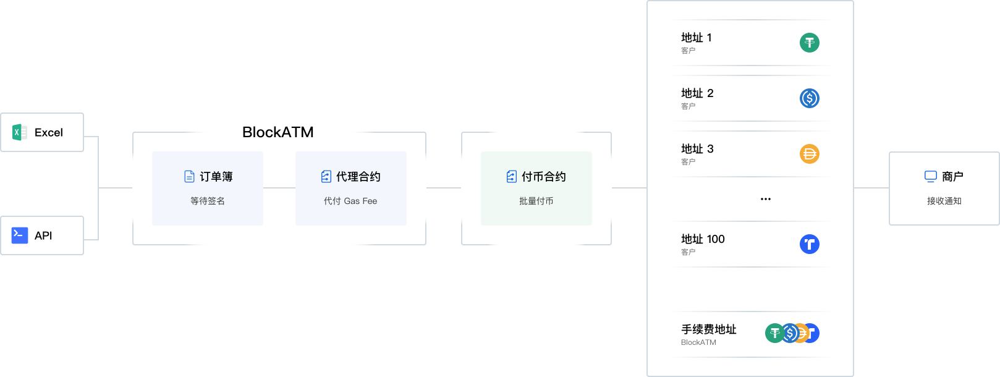

---
layout:
  title:
    visible: true
  description:
    visible: false
  tableOfContents:
    visible: true
  outline:
    visible: true
  pagination:
    visible: true
---

# 运作流程

BlockATM 提供两种方式上传付币订单（API 上传、导入 Excel 上传），上传的付币订单需要付币合约中指定的"授权签名地址"进行审核并签名确认，确认过的付币订单将通过 BlockATM 付币代理合约批量付币并支付Gas Fee（付币资金、手续费、代付 Gas Fee 从商户的付币合约中扣除）。

<figure><figcaption></figcaption></figure>


付币合约的归属权属于商户/企业，而付币代理合约归属权属于 BlockATM ，付币代理合约主要提供API安全上传订单以及代付 Gas Fee 功能，以提高付币效率。详情介绍见：[付币合约](fu-bi-zhi-neng-he-yue.md)


