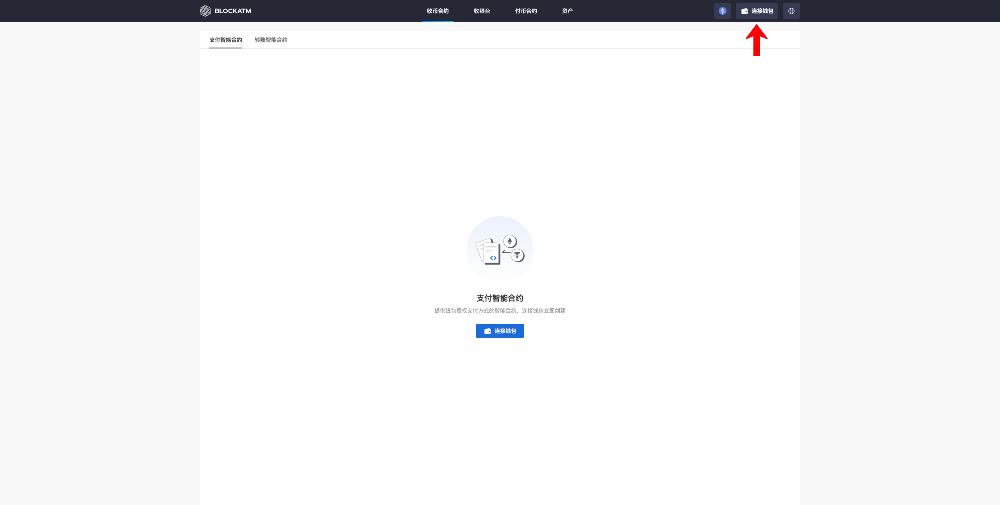
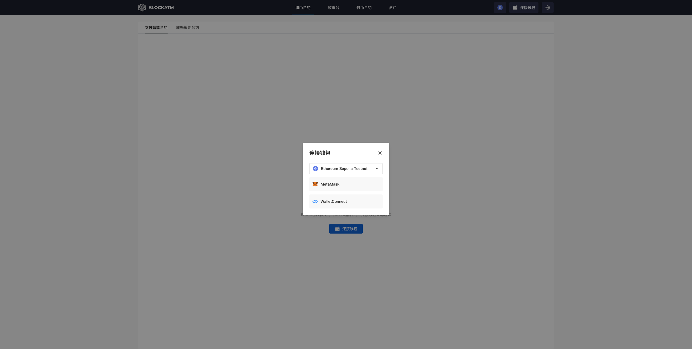
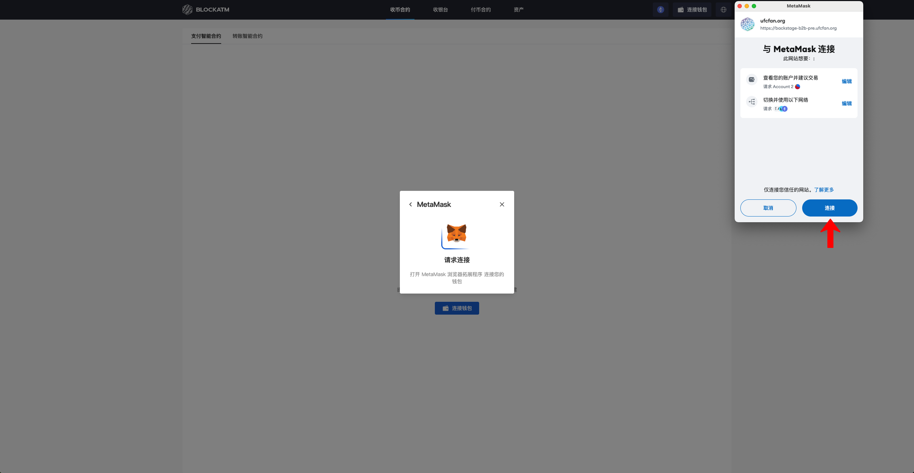
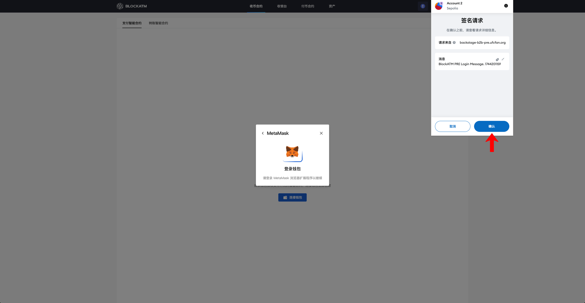
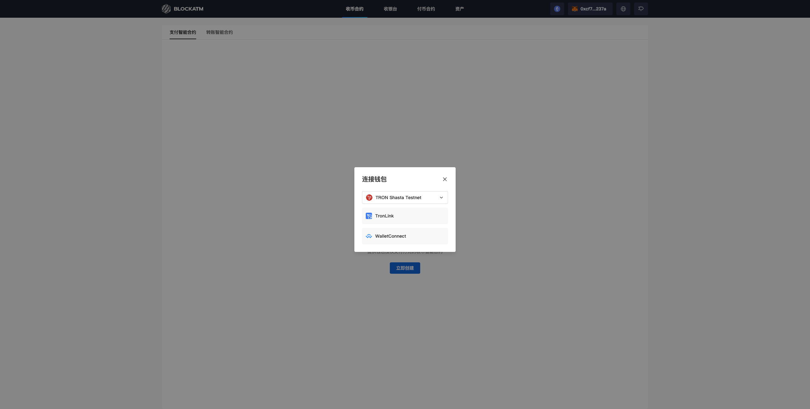
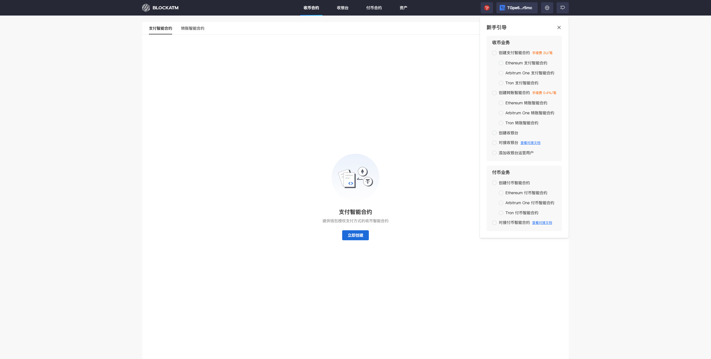

---
layout:
  title:
    visible: true
  description:
    visible: false
  tableOfContents:
    visible: true
  outline:
    visible: true
  pagination:
    visible: true
---

# Connect Wallet

BlockATM is a DApp operating on the blockchain, logging in by connecting your wallet. Click the "Connect Wallet" button at the top right of the BlockATM page to start connecting your wallet.

<figure><figcaption></figcaption></figure>

Choose the method of connecting to the network and wallet.

If you choose the Ethereum or Arbitrum network, the ways to connect your wallet are MetaMask and WalletConnect. Here we demonstrate using the MetaMask browser extension program to connect.

<figure><figcaption></figcaption></figure>

Clicking "MetaMask" will prompt the MetaMask wallet browser extension to confirm the connection, click "Connect".

<figure><figcaption></figcaption></figure>

The wallet then pops up a signature request window, click "confirm" to proceed with the login confirmation.

<figure><figcaption></figcaption></figure>

After confirmation, you can successfully connect the wallet.

<figure><figcaption></figcaption></figure>

If you choose the Tron network, the only way to connect your wallet is through TronLink. For detailed connection instructions, please refer to [How to connect Tronlink wallet](../../network-or-token-or-wallet/wallets/tronlink/ru-he-lian-jie-tronlink-qian-bao.md).

<figure><figcaption></figcaption></figure>

Clicking "TronLink" will prompt the TronLink wallet browser extension to confirm the connection. Click "Connect".

<figure><figcaption></figcaption></figure>

The wallet then pops up a signature request window, click "confirm" to proceed with the login confirmation.

<figure><figcaption></figcaption></figure>

After confirmation, you can successfully connect the wallet.

<figure><figcaption></figcaption></figure>
