---
layout:
  title:
    visible: true
  description:
    visible: false
  tableOfContents:
    visible: true
  outline:
    visible: true
  pagination:
    visible: true
---

# Create Collection Contract

There are two types of Collection Contracts: Web3 Collection Contract and Scan2Pay Contract. Both types are used for token collection, but they differ in the payment method. The Web3 Collection Contract provides a wallet connection for authorized transactions, while the Scan2Pay Contract offers a payment method through QR code scanning and transfer.

### Create Web3 Collection Contract

On the Collection Contract - Web3 Collection Contract page, click the "Create Now" button.

<figure>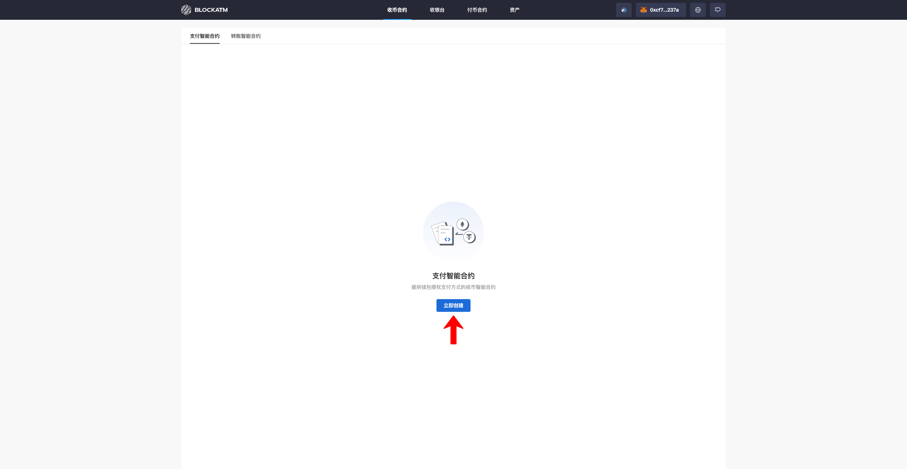<figcaption></figcaption></figure>

In the Create Web3 Collection Contract popup, enter the contract information.

<figure>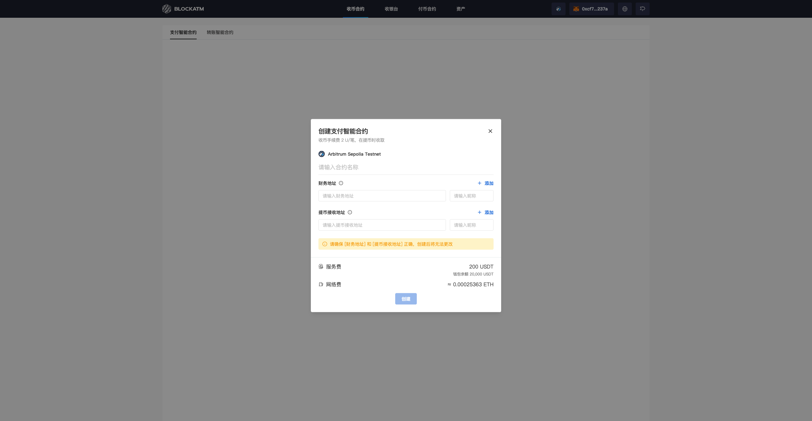<figcaption></figcaption></figure>

After entering the information, click "Create" (Note: Make sure you have 200 USDT and enough Gas Fee ready; if either USDT or Gas Fee is insufficient, the contract cannot be created).

<figure>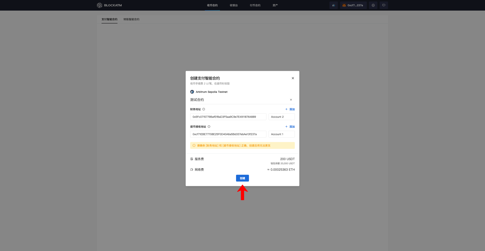<figcaption></figcaption></figure>

After clicking "Create," your wallet will prompt for USDT expenditure authorization (the service fee for creating the contract).

<figure>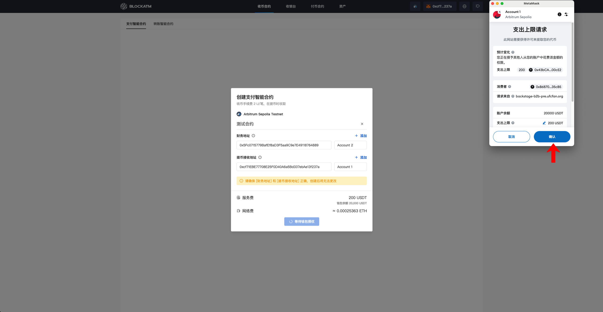<figcaption></figcaption></figure>

Next, sign and confirm your agreement to deploy the smart contract, and then wait for the blockchain to confirm the transaction.

<figure>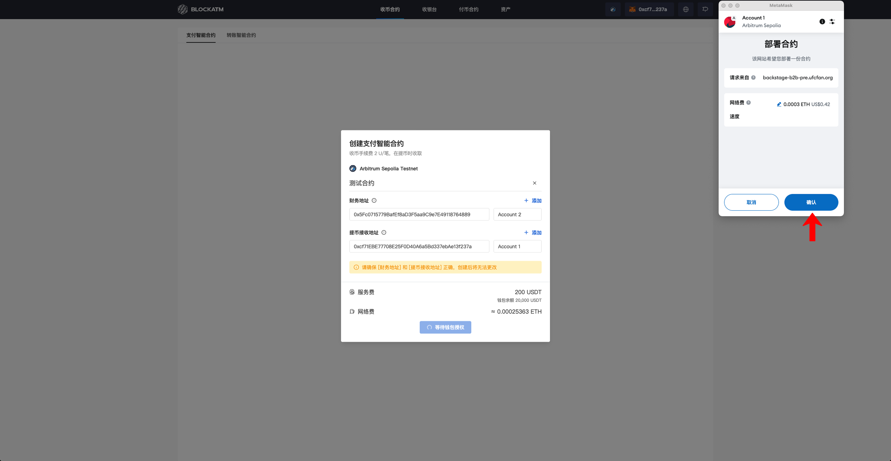<figcaption></figcaption></figure>

Once the blockchain confirms the transaction, the Web3 Collection Contract will be successfully created. The popup will close, and you will see the newly created contract on the list page.

<figure>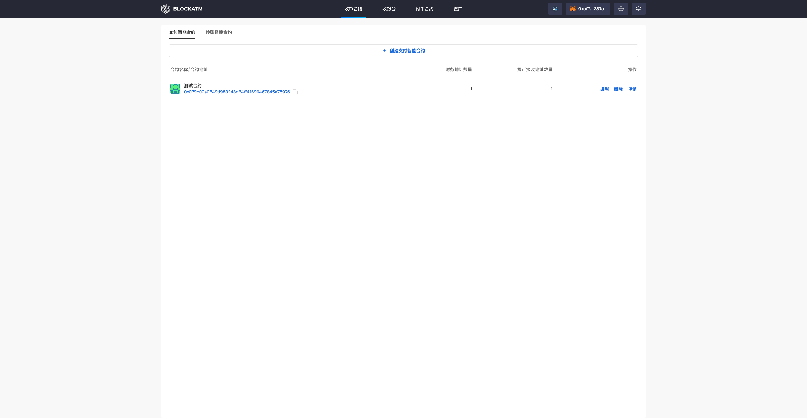<figcaption></figcaption></figure>

### Create Scan2Pay Contract


When creating a Scan2Pay Contract, you need to specify the "Authorized Signer Address" and the associated "Asset Receiving Address." This means that the creation of a Scan2Pay Contract requires first creating a Web3 Collection Contract.


On the Collection Contract - Scan2Pay Contract page, click the "Create Now" button.

<figure>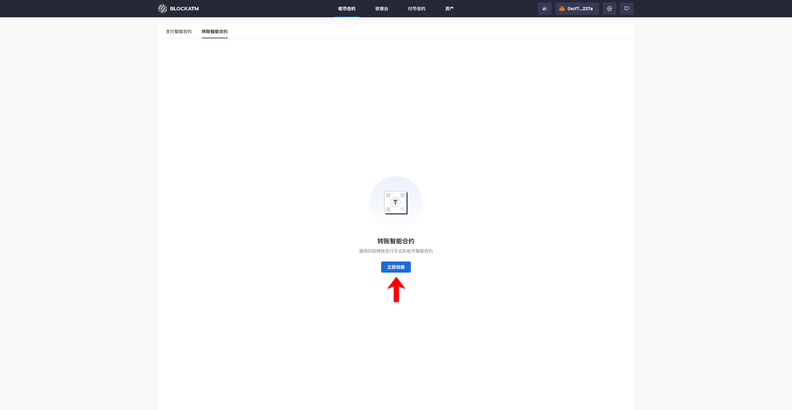<figcaption></figcaption></figure>

In the Create Scan2Pay Contract popup, enter the contract information.

<figure>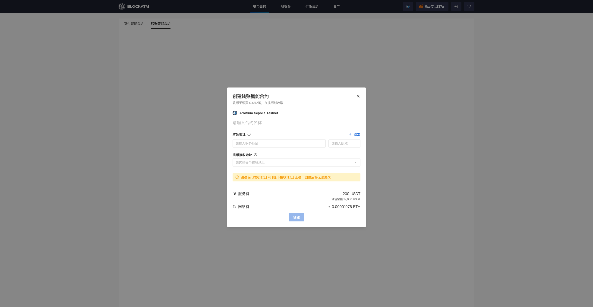<figcaption></figcaption></figure>

After entering the information, click "Create" (Note: Make sure you have 200 USDT and enough Gas Fee ready; if either USDT or Gas Fee is insufficient, the contract cannot be created).

<figure>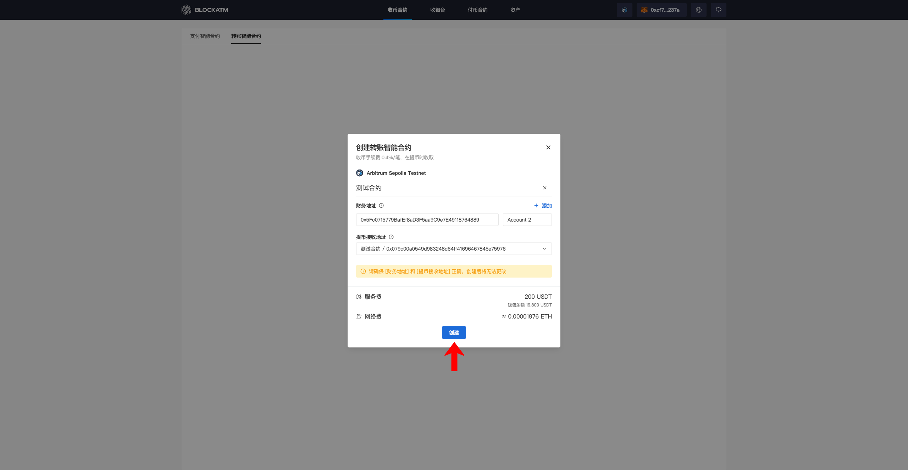<figcaption></figcaption></figure>

After clicking "Create," your wallet will prompt for USDT expenditure authorization (the service fee for creating the contract).

<figure>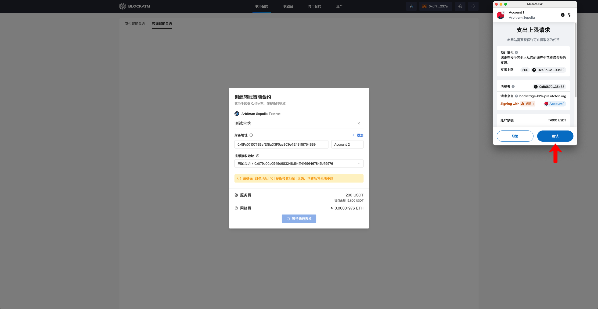<figcaption></figcaption></figure>

Next, sign and confirm your agreement to deploy the smart contract, and then wait for the blockchain to confirm the transaction.

<figure>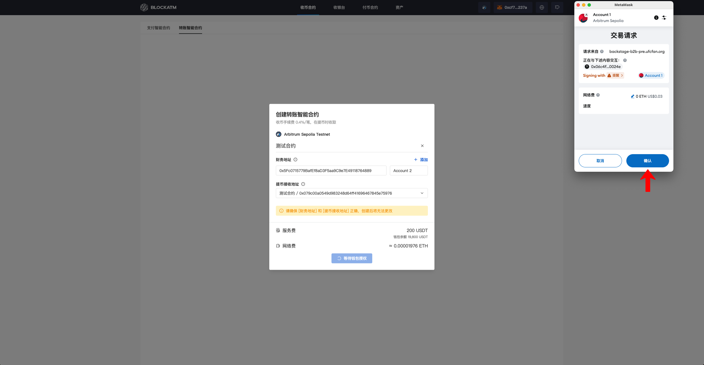<figcaption></figcaption></figure>

Once the blockchain confirms the transaction, the Scan2Pay Contract will be successfully created. The popup will close, and you will see the newly created contract on the list page.

<figure>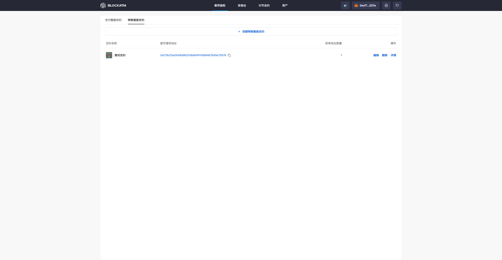<figcaption></figcaption></figure>

