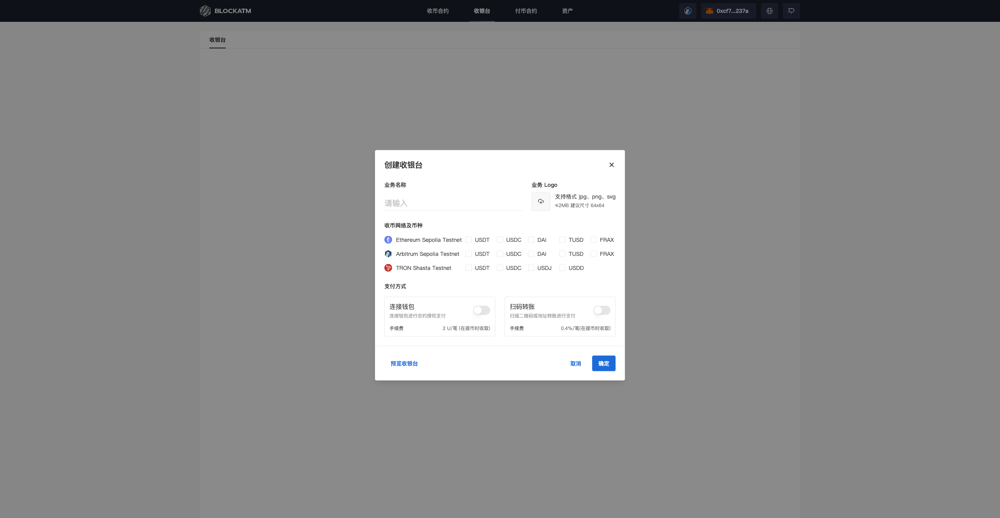
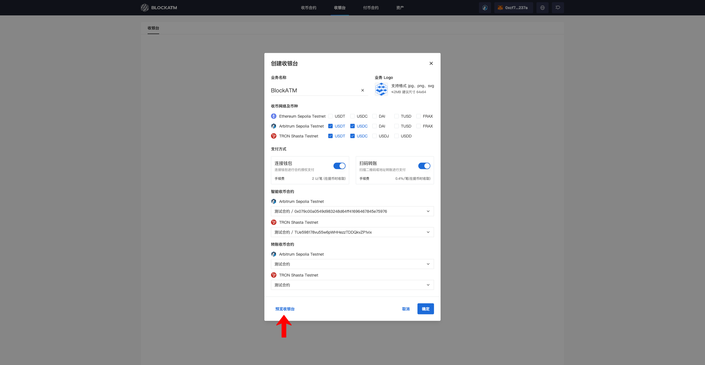
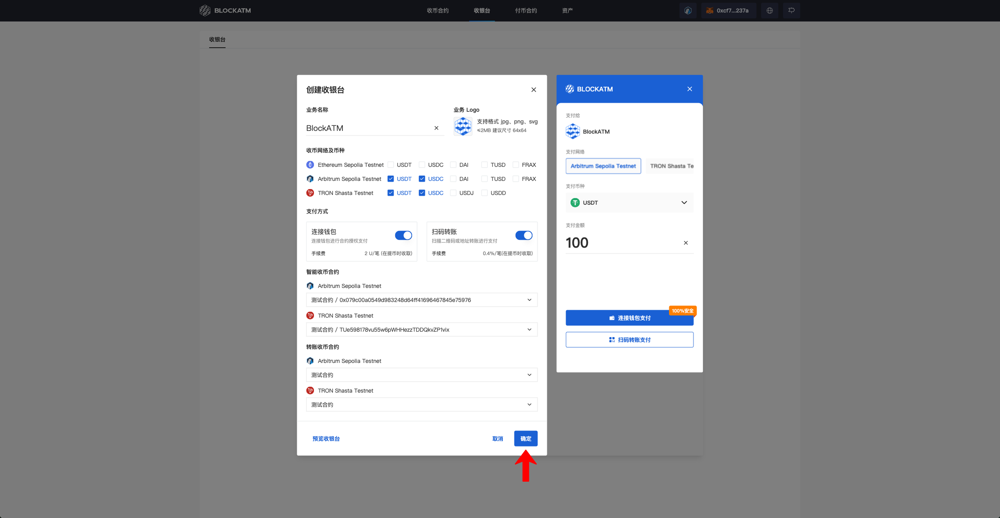

---
layout:
  title:
    visible: true
  description:
    visible: false
  tableOfContents:
    visible: true
  outline:
    visible: true
  pagination:
    visible: true
---

# Create Cashier Desk

After [Creating Collection Contract](chuang-jian-shou-bi-zhi-neng-he-yue.md), you can create a Cashier Desk. Go to the Cashier Desk page and click "Create Now."

<figure><figcaption></figcaption></figure>

In the Create Cashier Desk popup, enter your business information, choose the collection network and token, enable the payment methods, and bind the Collection Contract (a Collection Contract can only be bound to one Cashier Desk).

<figure><figcaption></figcaption></figure>

Once the configuration is complete, you can click the "Preview Cashier Desk" button at the bottom left to preview the Cashier Desk.

<figure><figcaption></figcaption></figure>

After confirming the preview, click "Confirm" to complete the creation of the Cashier Desk.

<figure><figcaption></figcaption></figure>

<figure><figcaption></figcaption></figure>
