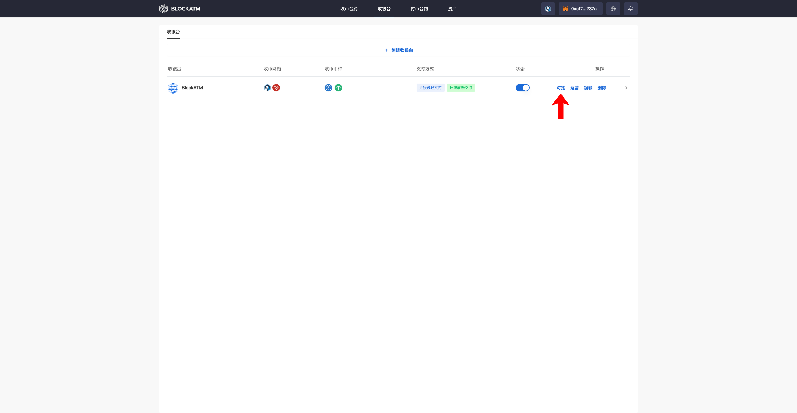
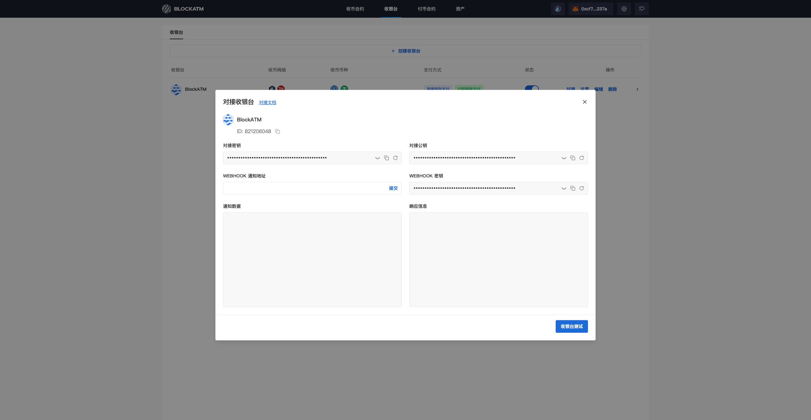
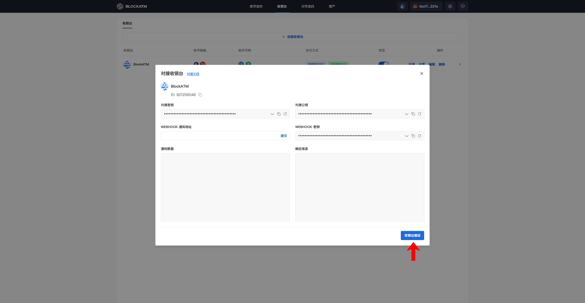
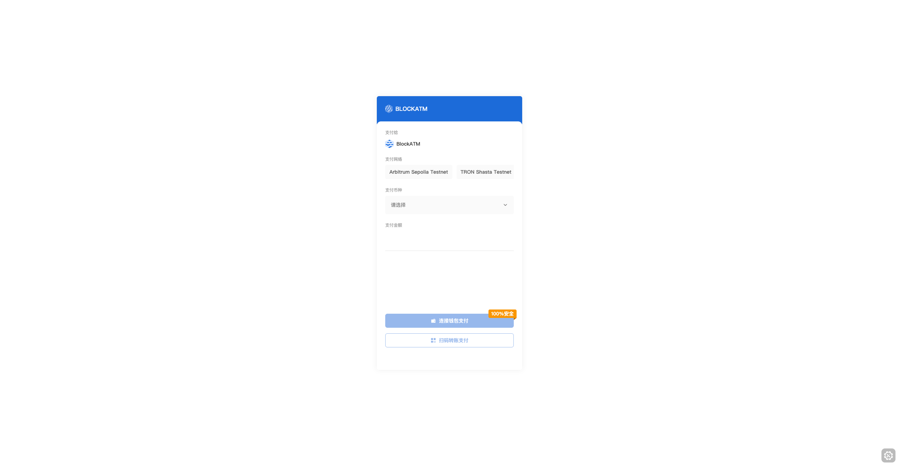

---
layout:
  title:
    visible: true
  description:
    visible: false
  tableOfContents:
    visible: true
  outline:
    visible: true
  pagination:
    visible: true
---

# Integrate Cashier Desk

After [creating the Cashier Desk](chuang-jian-shou-yin-tai.md), click "Integrate" to integrate the Cashier Desk into your business system and receive order status notifications.

<figure><figcaption></figcaption></figure>

In the Cashier Desk integration popup, you can see the Cashier Desk ID, integration public key, Webhook key, and Webhook notification URL.

<figure><figcaption></figcaption></figure>


Integration Steps Description:

* Configure the integration key into your system to encrypt or sign the request data.
* Configure the integration public key into your system to verify the received data's signature.
* Enter the Webhook notification URL to receive notifications from BlockATM. Ensure that this URL can properly receive and handle HTTP POST requests.
* Configure the Webhook key into your system and perform signature verification when receiving notifications.
* Use the integration key to encrypt or sign the request data, then send it via an HTTP request to the BlockATM API endpoint.
* Deploy an interface on your server that can receive Webhook notifications. When BlockATM sends a notification, your interface will receive an HTTP POST request. You need to verify the signature of the received data.
* Send a test request to the BlockATM API endpoint and check if the returned result matches your expectations.
* Trigger BlockATM to send a Webhook notification and check if your server is able to receive and process the notification correctly.


Once the integration is complete, click "Test Cashier" to perform testing and verification.

<figure><figcaption></figcaption></figure>

The crypto you paid will be sent to your smart contract. Once BlockATM detects a successful transaction on the blockchain, it will send a Webhook notification to the Webhook notification address you configured.

<figure><figcaption></figcaption></figure>
