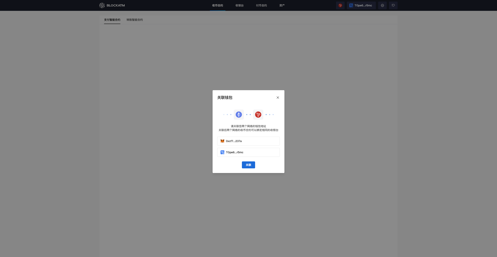

---
layout:
  title:
    visible: true
  description:
    visible: false
  tableOfContents:
    visible: true
  outline:
    visible: true
  pagination:
    visible: true
---

# Link ERC20 and TRC20 wallets

After creating a smart contract ([Collection Contract](../../../business-description/safePay/shou-bi-zhi-neng-he-yue.md) or [Payout Contract](../../../batchWithdraw/fu-bi-zhi-neng-he-yue.md)), the wallet address of the contract owner will serve as the admin address. When creating a Cashier Desk, the admin address can choose to link the Collection Contract of the target network. To link both ERC and TRC networks, you need to associate the ERC20 and TRC20 wallets.

### Link Wallet Address


Assuming you first create a Collection Contract on the ERC network and then switch to the TRC network.


Click the "Network" in the top right corner and switch to "Tron."

<figure><figcaption></figcaption></figure>

A pop-up will appear with wallet connection options for the Tron network (TronLink, WalletConnect). This demonstration will use the TronLink browser extension to connect.

<figure><figcaption></figcaption></figure>

After clicking "TronLink," the TronLink wallet browser extension will be triggered to confirm the connection.

<figure><figcaption></figcaption></figure>

After a successful connection, a linking popup will appear. Click "Link" to complete the wallet association between the ERC and TRC networks.

<figure><figcaption></figcaption></figure>

After the wallets are linked, when creating a Cashier, you can bind the Collection Contracts created with both wallet addresses (ERC and TRC networks) to the Cashier Desk simultaneously.
