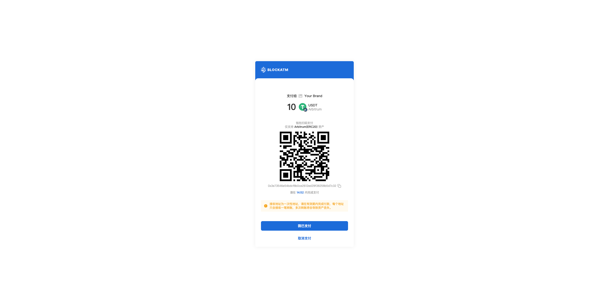
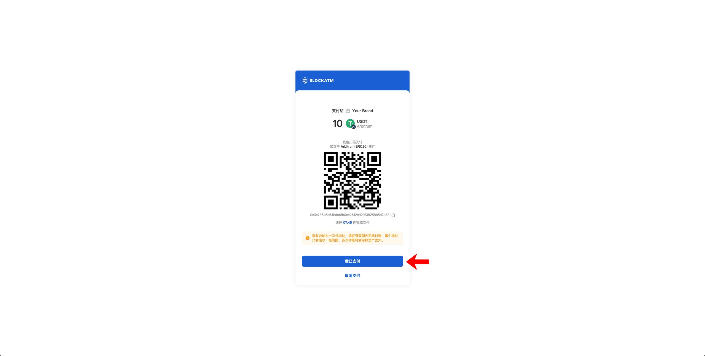

---
layout:
  title:
    visible: true
  description:
    visible: false
  tableOfContents:
    visible: true
  outline:
    visible: true
  pagination:
    visible: true
---

# Collection

After integrating the cashier, your users will be able to trigger the BlockATM cashier from your platform to make payments.

### Payment Flow Demo

Your users trigger the BlockATM checkout on your platform.

<figure><figcaption></figcaption></figure>

After entering the BlockATM checkout, they select the payment network, currency, and enter the payment amount.

<figure><figcaption>
Payment information not selected
</figcaption></figure>

<figure><figcaption>
Payment information selected
</figcaption></figure>

Next, select the payment method.

If you choose to **Connect Wallet to Pay**, the wallet connection method will be prompted (using MetaMask (browser extension) as an example).

<figure><figcaption></figcaption></figure>

After selecting MetaMask, the wallet will be prompted for connection. Click "Connect" and agree to link the wallet with the BlockATM checkout.

<figure><figcaption></figcaption></figure>

After connecting the wallet, the checkout will proceed to the payment confirmation page. Click "Pay Now" to begin the payment process.

<figure><figcaption></figcaption></figure>

First, the wallet will prompt a spending limit request. Click "Confirm" to agree to the smart contract calling the specified amount of assets from the wallet.

<figure><figcaption></figcaption></figure>

Next, a transaction request will pop up. Click "Confirm" to proceed with the on-chain transaction.

<figure><figcaption></figcaption></figure>

After confirming the transaction, wait for the blockchain confirmation.

<figure><figcaption></figcaption></figure>

Once the blockchain confirmation is complete, the transaction is finished. The user can visit the blockchain explorer to view the transaction details.

<figure><figcaption></figcaption></figure>

If you choose **Scan to Pay**

The checkout will proceed to the payment confirmation page, displaying the receipt address QR code.

<figure><figcaption></figcaption></figure>

Open the wallet app to scan the receipt address QR code, or copy the receipt address into the wallet app to make the transfer (using MetaMask App as an example).

<figure><figcaption></figcaption></figure>

After confirming the receiving address, enter the payment amount (Note: It must match the payment amount displayed on the BlockATM checkout, otherwise the payment will be invalid). After entering the amount, click "Next".

<figure><figcaption></figcaption></figure>

Confirm the transaction details and click "Send".

<figure><figcaption></figcaption></figure>

After sending, wait for the blockchain confirmation.

<figure><figcaption></figcaption></figure>

<figure><figcaption></figcaption></figure>

Note: If the checkout page does not automatically redirect to the result page after the wallet executes the transaction, you can click the "I Have Paid" button.

<figure><figcaption></figcaption></figure>

Once the blockchain confirmation is complete, the transaction is finished. The user can visit the blockchain explorer to view the transaction details.

<figure><figcaption></figcaption></figure>

<figure><figcaption></figcaption></figure>

At this point, you (the merchant) can find the corresponding checkout in the BlockATM DApp checkout module and click to enter the order page to view the transaction records.

<figure><figcaption></figcaption></figure>

<figure><figcaption></figcaption></figure>
