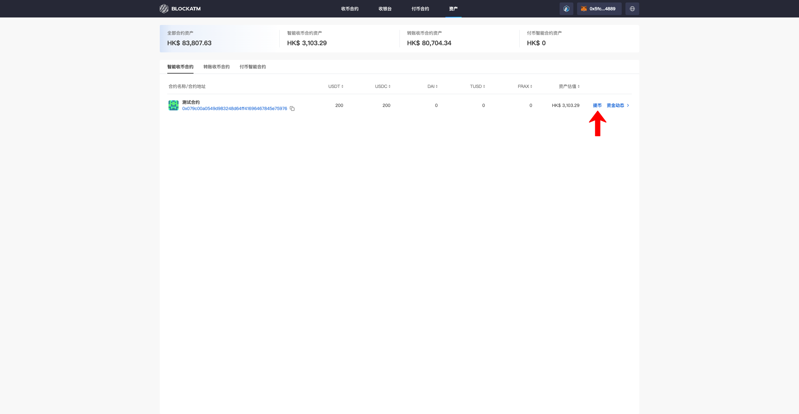
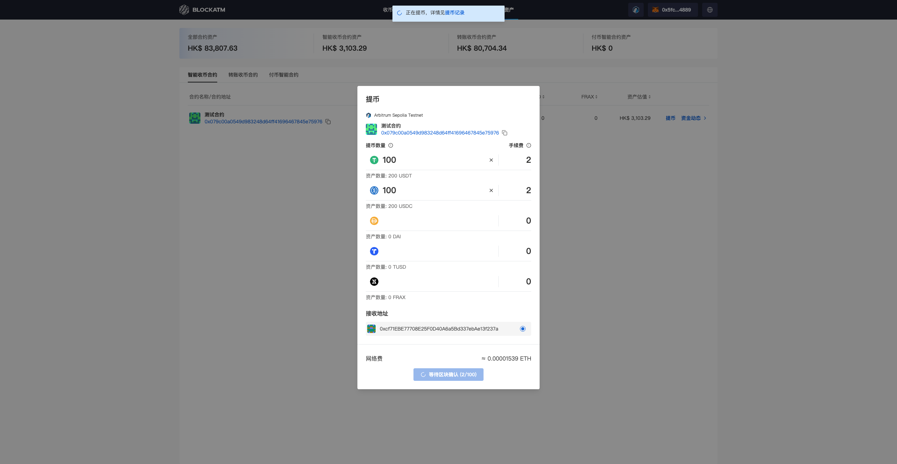
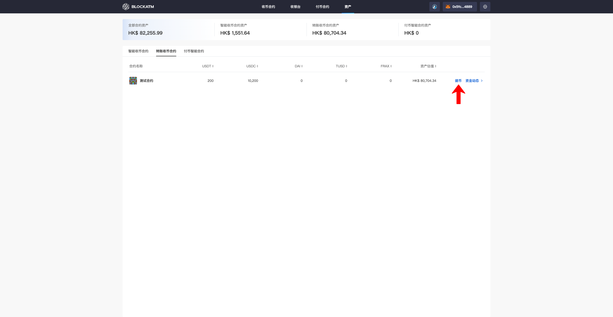
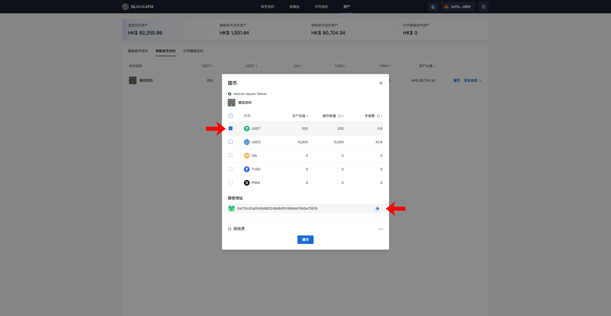
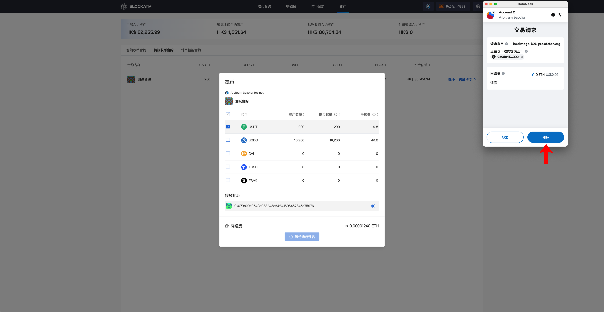
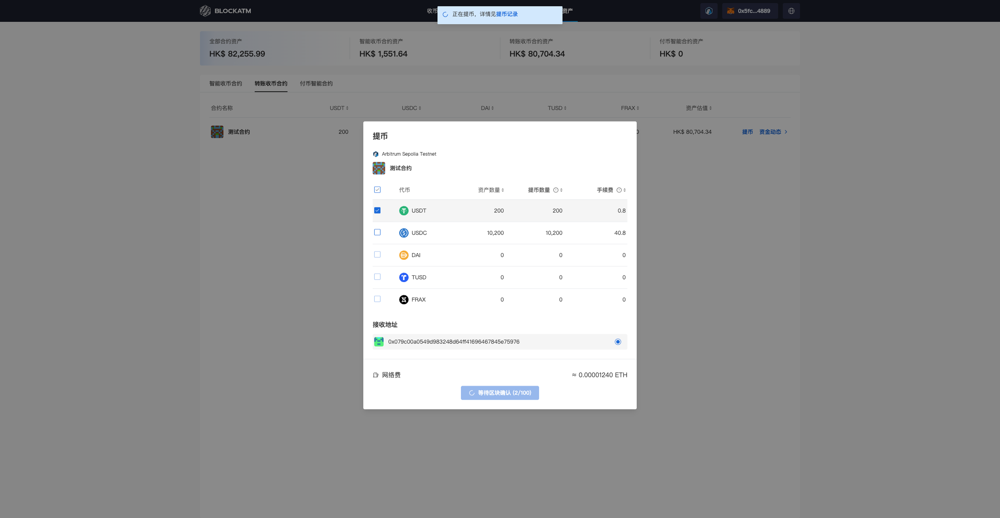

---
layout:
  title:
    visible: true
  description:
    visible: false
  tableOfContents:
    visible: true
  outline:
    visible: true
  pagination:
    visible: true
---

# Withdraw

The cryptocurrency received by the Cashier Desk is held in the associated Collection Contract. To withdraw assets from the Collection Contract, the withdrawal must be initiated by the contract's designated "Authorized Signer Address" and sent to the contract's specified "Asset Receiving Address" (for permissions related to the "Authorized Signer Address" and "Asset Receiving Address," please refer to the Collection Contract).

### Web3 Collection Contract Withdrawal

First, connect the "Authorized Signer Address" wallet. The "Authorized Signer Address" can be found under the Asset Module -- Web3 Collection Contract. You will see the "Withdraw" button. Click on "Withdraw."

<figure><figcaption></figcaption></figure>

The withdrawal popup will display the asset quantities of each token in the Web3 Collection Contract, along with the withdrawal fee.

<figure><figcaption></figcaption></figure>

Enter the withdrawal amount for the token to be withdrawn and select the "Asset Receiving Address." At this point, the "Withdraw" button will be highlighted. Then, click "Withdraw."

<figure><figcaption></figcaption></figure>

Clicking "Withdraw" will trigger a wallet signature to authorize the transaction.

<figure><figcaption></figcaption></figure>

After authorization, the transaction will be executed, and you will need to wait for blockchain confirmation.

<figure><figcaption></figcaption></figure>

Once the blockchain confirmation is complete, the withdrawal will be successful.

***

### Scan2Pay Contract Withdrawal

First, connect the "Authorized Signer Address" wallet. The "Authorized Signer Address" can be found under the Asset Module -- Scan2Pay Contract. You will see the "Withdraw" button. Click on "Withdraw."

<figure><figcaption></figcaption></figure>

The withdrawal popup will display the asset quantities of each token in the Scan2Pay Contract, along with the withdrawal fee.

<figure><figcaption></figcaption></figure>

Select the token to withdraw (the default is to withdraw the full amount) and choose the "Asset Receiving Address." At this point, the "Withdraw" button will be highlighted. Then, click "Withdraw."

<figure><figcaption></figcaption></figure>

Clicking "Withdraw" will trigger the wallet to sign and authorize the transaction.

<figure><figcaption></figcaption></figure>

After authorization, the transaction will be executed, and you will need to wait for blockchain confirmation.

<figure><figcaption></figcaption></figure>

Once the blockchain confirmation is complete, the withdrawal will be successful.

<figure><figcaption></figcaption></figure>
