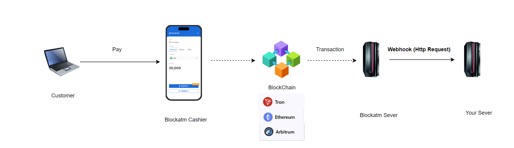

---
layout:
  title:
    visible: true
  description:
    visible: false
  tableOfContents:
    visible: true
  outline:
    visible: true
  pagination:
    visible: true
---

# Handling of Abnormal Orders

Under normal circumstances, Collection orders are processed smoothly, but there is a small chance that an abnormal situation may occur:

* **Missing Order**: The user chooses Scan to Pay and has completed the payment, but the order status has not been updated to "successful".
* **Notification Error**: The order's Webhook notification has been sent, but the merchant did not receive it.

To address the two types of abnormal orders mentioned above, action is required—but only the checkout's operator address has the permission to handle such exceptions. The operator address must be added to the cashier desk by the owner.

### Add a Cashier Desk Operator

The admin address is listed in the Cashier Desk. Click the "Operate" button to open the operator user popup.

<figure><figcaption></figcaption></figure>

In the operator user popup, click "Add Operator".

<figure><figcaption></figcaption></figure>

Then, in the Add Operator popup, enter the operator's wallet address and nickname. Once completed, click "Add" to successfully add the operator.

<figure><figcaption></figcaption></figure>

<figure><figcaption></figcaption></figure>

### Operator wallet login

The operator wallet connects to the BlockATM DApp and can only see the relevant Cashier Desk. Click on the "Collection Orders" in the Cashier Desk to enter the order page.

<figure><figcaption></figcaption></figure>

<figure><figcaption></figcaption></figure>

### Order drop -- Manually complete the transaction

Orders made through Scan to Pay may encounter order drops (with transaction status as Pending, Canceled, Expired, or Failed). If an order is dropped, the operator can manually complete the order within 72 hours. A "Complete Transaction" button will appear in the action column. Click "Complete Transaction" to open the manual order completion popup.

<figure><figcaption></figcaption></figure>

In the popup, select the reason for the order completion and enter the TXID. Click "Confirm" to complete the order.

<figure><figcaption></figcaption></figure>

The status of successfully completed orders will change to "Completed."

<figure><figcaption></figcaption></figure>

### Notification Exception -- Resend Notification

If your business system has not received the Webhook notification for a Collection Order with the status "Completed" or "Failed," the operator can click the "Resend Notification" button in the action column within 72 hours to resend the Webhook notification.

<figure><figcaption></figcaption></figure>
