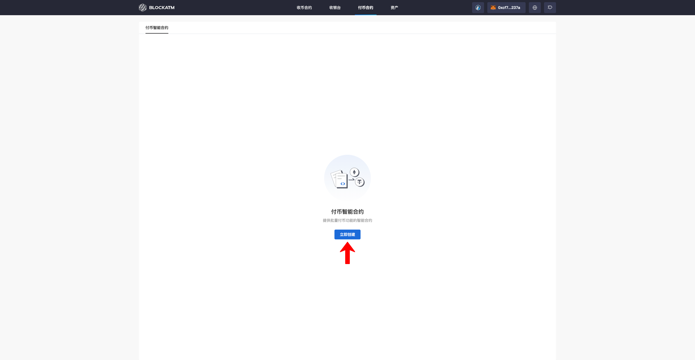
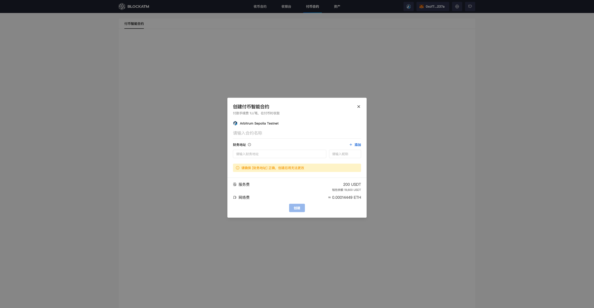
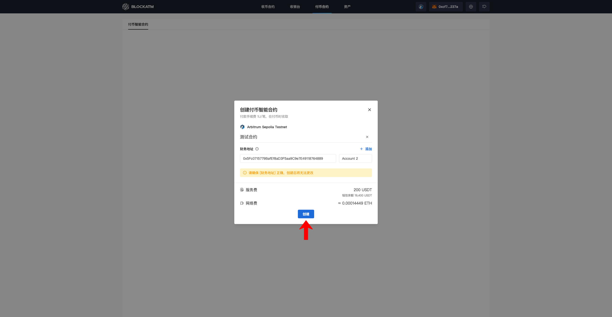
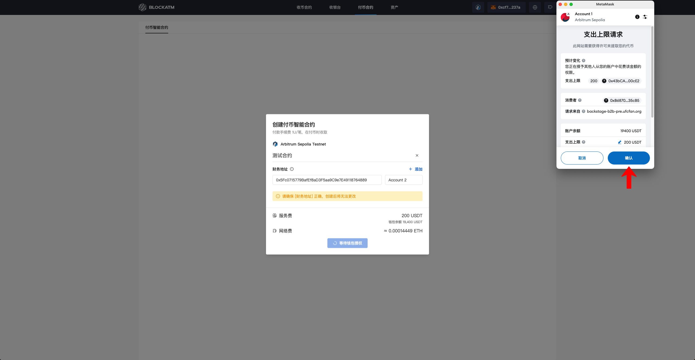
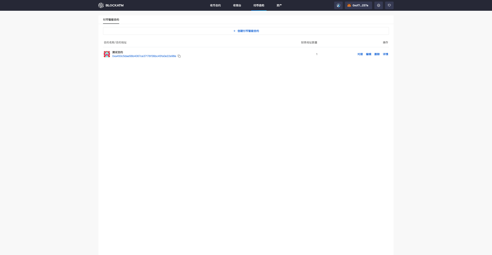

---
layout:
  title:
    visible: true
  description:
    visible: false
  tableOfContents:
    visible: true
  outline:
    visible: true
  pagination:
    visible: true
---

# Create Payout Contract

On the Payout Contract page, click the "Create Now" button.

<figure><figcaption></figcaption></figure>

In the "Create Payout Contract" popup, enter the contract information.

<figure><figcaption></figcaption></figure>

Once the information is entered, click "Create" (Note: Make sure you have 200 USDT and sufficient Gas Fee prepared in advance; otherwise, the contract cannot be created).

<figure><figcaption></figcaption></figure>

After clicking "Create," the wallet will be prompted to authorize the USDT expenditure (for the contract creation service fee).

<figure><figcaption></figcaption></figure>

Next, sign and confirm to agree to deploy the smart contract, and then wait for the blockchain to confirm the transaction completion.

<figure><figcaption></figcaption></figure>

Once the blockchain confirmation is complete and the transaction is finished, the Payout Contract will be successfully created. The popup will close, and the newly created contract will appear in the list page.

<figure><figcaption></figcaption></figure>

