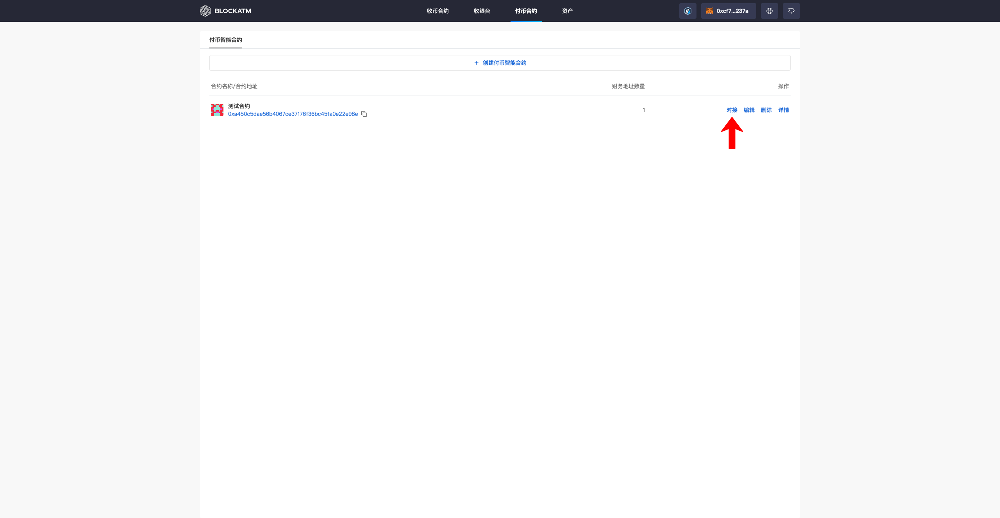
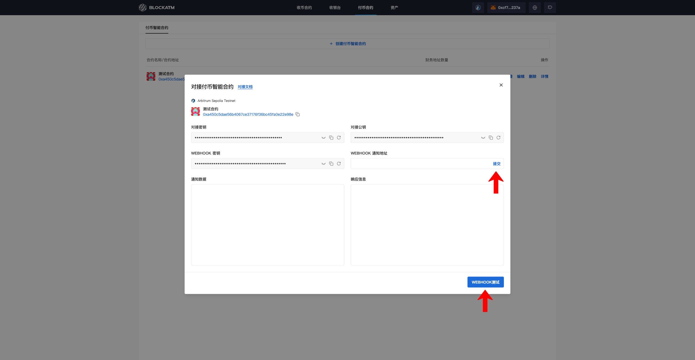

---
layout:
  title:
    visible: true
  description:
    visible: false
  tableOfContents:
    visible: true
  outline:
    visible: true
  pagination:
    visible: true
---

# Integrate the Payout Contract

After [creating the Payout Contract](chuang-jian-fu-bi-zhi-neng-he-yue.md), click "Integrate" to enable API uploads of Payout orders and receive Payout result notifications.

<figure><figcaption></figcaption></figure>

In the Payout Contract integration popup, you will see the contract information, integration key public key, Webhook key, and Webhook notification URL.

<figure><figcaption></figcaption></figure>


Integration Step Instructions

1. Configure the integration key into your system to encrypt or sign the request data. This ensures secure communication between your system and the Payout Contract.
2. Configure the integration public key into your system to verify the received data. This ensures the authenticity and integrity of the information from the Payout Contract.
3. Enter the Webhook notification URL to receive the notification messages sent by BlockATM. Ensure that the URL is capable of receiving and processing HTTP POST requests properly.
4. Configure the Webhook key into your system and perform signature verification when receiving notifications. This ensures the integrity and authenticity of the messages sent by BlockATM.
5. Use the integration key to encrypt or sign the request data, and then send it via an HTTP request to the BlockATM API endpoint. This ensures secure and authenticated communication between your system and BlockATM.
6. Deploy an endpoint on your server capable of receiving Webhook notifications. When BlockATM sends a notification, your endpoint will receive an HTTP POST request. You need to verify the signature of the received data to ensure its authenticity and integrity.
7. Send a test request to the BlockATM API endpoint and check if the returned results match the expected outcome. This helps ensure that the integration is working correctly.
8. Trigger BlockATM to send a Webhook notification and check if your server can properly receive and process the notification. This ensures that the Webhook integration is functioning as expected.


After completing the integration, click "Webhook Test" to perform a Webhook test and verification. This ensures that the Webhook is correctly set up and functioning as expected.

<figure><figcaption></figcaption></figure>
