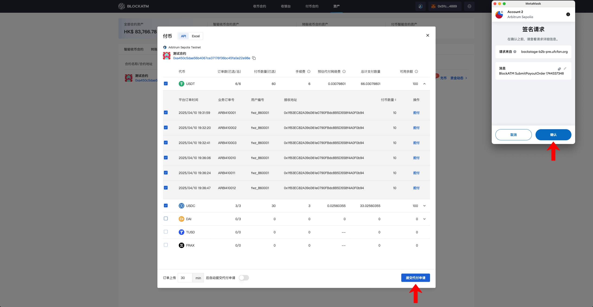
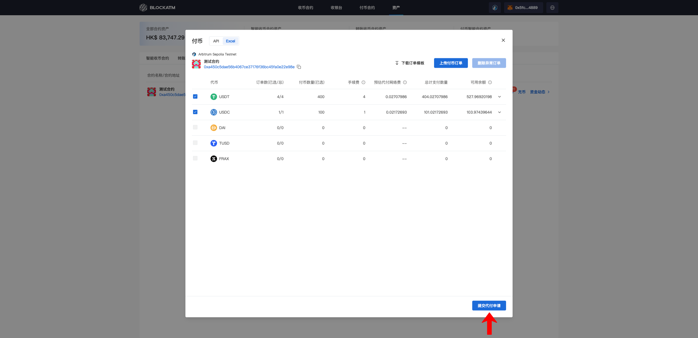
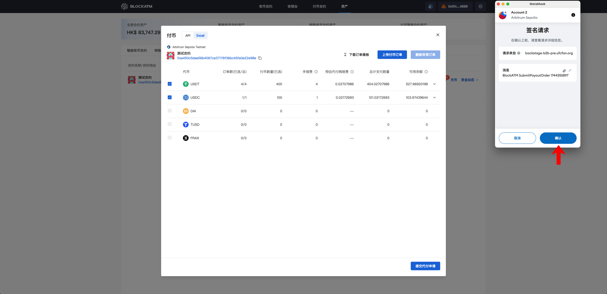
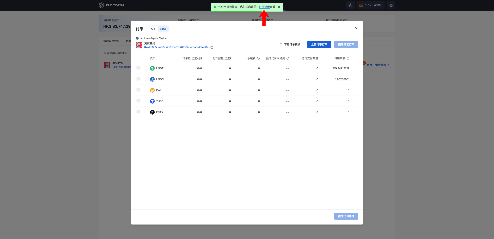

---
layout:
  title:
    visible: true
  description:
    visible: false
  tableOfContents:
    visible: true
  outline:
    visible: true
  pagination:
    visible: true
---

# Upload and confirm the Payout order

Once the Payout Contract is created and sufficiently funded, you can proceed with the Payout operation. BlockATM offers two methods for uploading Payout orders: API upload and Excel import. It's important to note that Payouts can only be executed by the contract's designated "Authorized Signer Address" (for the permissions of the "Authorized Signer Address," refer to the [Payout Contract](../../../batchWithdraw/fu-bi-zhi-neng-he-yue.md)).

### API Upload Payout Order

Prerequisite: The Payout Contract needs to [be integrated](dui-jie-fu-bi-zhi-neng-he-yue.md) first.

First, connect the "Authorized Signing Address" wallet. The "Authorized Signing Address" can be found in the Assets module under the Payout Contract, where you will see the "Payout" button (the number of orders will be displayed on the "Payout" button when there are pending orders).

<figure><figcaption></figcaption></figure>

Clicking on "Payout" will open the Payout popup, which by default displays the orders uploaded via the API. Click on the list to expand and view the details of the payout orders for each token.

<figure><figcaption></figcaption></figure>

After expanding, carefully verify the order information one by one. If any abnormal orders are found, you can choose to "Reject Payment" or simply "Uncheck" them first.

<figure><figcaption></figcaption></figure>

If you choose to reject the payment, a wallet signature confirmation will be triggered (ensure that the "Authorized Signing Address" is the one performing the action).

<figure><figcaption></figcaption></figure>

After verifying the orders, click "Submit Payout Request," which will trigger the wallet signature confirmation (ensure that the "Authorized Signing Address" is the one performing the action).

<figure><figcaption></figcaption></figure>

Once submitted, you can click "Payout Records" to check the status of the payout orders (you can also view it in the Assets module under Payout Contract → Fund Dynamics → Payout Records).

<figure><figcaption></figcaption></figure>

The status of the recently submitted payout order will be "Pending Payment," and the payment will be completed within 24 hours.

<figure><figcaption></figcaption></figure>

To enable automation and eliminate the need for manual review by the "Authorized Signing Address," you can activate the auto-submit feature. When an order is uploaded, if the "Authorized Signing Address" does not review it within a certain time, the system will automatically review and submit the order.

<figure><figcaption></figcaption></figure>

### Import Excel to upload payout orders

First, connect the "Authorized Signing Address" wallet. The "Authorized Signing Address" can be found in the Assets module under the Payout Contract, where you will see the "Payout" button (the number of orders will be displayed on the "Payout" button when there are pending orders). In the Payout popup, switch to the "Excel" tab.

<figure><figcaption></figcaption></figure>

Click on "Download Order Template" and fill in the payout order information in the template.

<figure><figcaption></figcaption></figure>

Note: Information such as network, token, and payout amount must be entered according to the specified rules.

<figure><figcaption></figcaption></figure>

Next, click on "Upload Payout Orders" to upload the Excel file to BlockATM.

<figure><figcaption></figcaption></figure>

Once the upload is successful, the order information for each token will be displayed. If the payout amount exceeds the token balance, it will be highlighted in red with a prompt. You will need to uncheck or delete some orders.

<figure><figcaption></figcaption></figure>

If orders with incorrect information or formatting are uploaded, they will be highlighted in red with an error message indicating the reason. You can delete the erroneous orders, adjust them based on the reason provided, and then re-upload the corrected file.

<figure><figcaption></figcaption></figure>

Once all orders are confirmed, click "Submit Payout Request."

<figure><figcaption></figcaption></figure>

A wallet signature confirmation will be triggered (ensure that the "Authorized Signing Address" is the one performing the action).

<figure><figcaption></figcaption></figure>

After the signature confirmation, you can click "Payout Records" to check the status of the payout orders (you can also view it in the Assets module under Payout Contract → Fund Dynamics → Payout Records).

<figure><figcaption></figcaption></figure>

The status of the recently submitted payout order will be "Pending Payment," and the payment will be completed within 24 hours.

<figure><figcaption></figcaption></figure>
