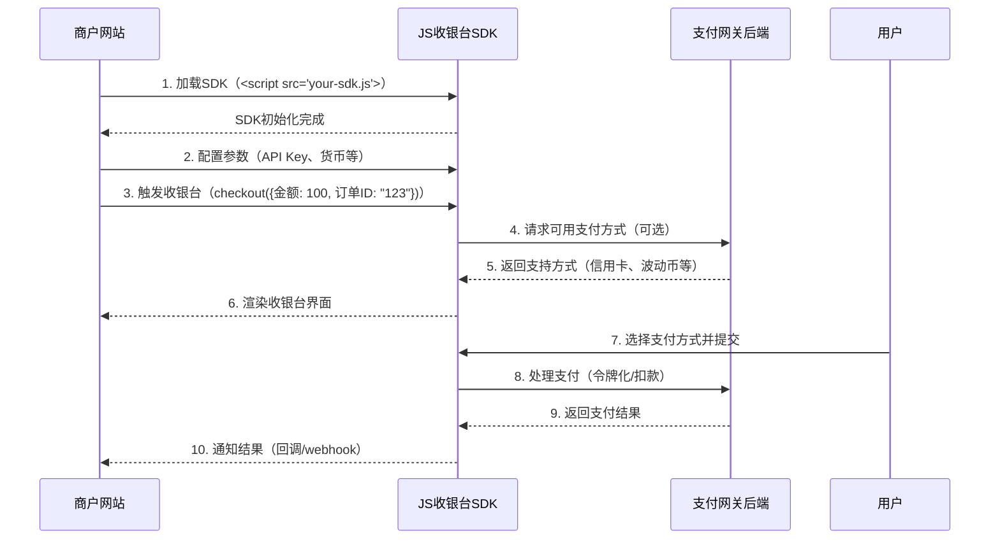

# Widget SDK

### 1. import

Add the SDK as a script to your HTML file.



```
<script src="https://cashier.blockatm.net/libs/v2/BlockATM.umd.js?apiKey=[API_KEY]"></script>
```



```
<script src="https://cashier-b2b-pre.ufcfan.org/libs/v2/BlockATM.umd.js?apiKey=[API_KEY]"></script>
```



Once you've included this script, you're ready to initialize the Web SDK and start integrating with our suite of cryptocurrency payment solutions.


You can obtain the Api Key in the merchant APP backend, **【Cashier】** ->[**【Integrate】**](https://app.blockatm.net/)

<figure><figcaption></figcaption></figure>


### 2.Signing

You need to sign your widget URL before you can display the widget. Learn more about [**URL signing**](params-sign/).

```javascript

// 1. Prepare payment parameters
const options = {
  custNo: 'CUST123456',          // Customer ID (required)
  orderNo: '473_800000001',      // Order number 
  lang: 'en-US',                 // Language (optional, default: en-US, supports zh-CN/zh-HK/en-US)
  chainId: 1,                    // Blockchain network ID (optional, 1=ETH Mainnet)
  currency: 'USDT',              // Cryptocurrency type (optional, e.g. USDT)
  amount: 100.5,                 // Payment amount (optional)
};

// 2. Generate signature parameters
const { urlForSignature } = window.BlockATM.generateUrlForSigning({ 
  ...options, 
  apiKey: 'YOUR_API_KEY'         // Replace with your API key
});

// 3. Get signature from backend
const { signature } = await fetch("/sign-url", {
  method: "POST",
  headers: { "Content-Type": "application/json" },
  body: JSON.stringify({ urlForSignature }),
}).then(res => res.json());
```

[See full parameters](widget-param.md)

### 3. Initialize

Initialize the SDK in your application with the flow, variant,lang and any parameters related to deposit cryptocurrency.

```javascript
// Initialize and show cashier.
window.BlockATM.init(
  document.getElementById('blockatm-container'), // Container element
  {
    ...options,
    signature,                                  // Signature from backend
    callback: ({ type }) => {                   // Payment result callback
      switch(type) {
        case 'cancel': 
          // Handle payment cancellation
          break;
        case 'finish': 
          // Handle successful payment
          break;
      }
    }
  }
);
```


````markdown

````
