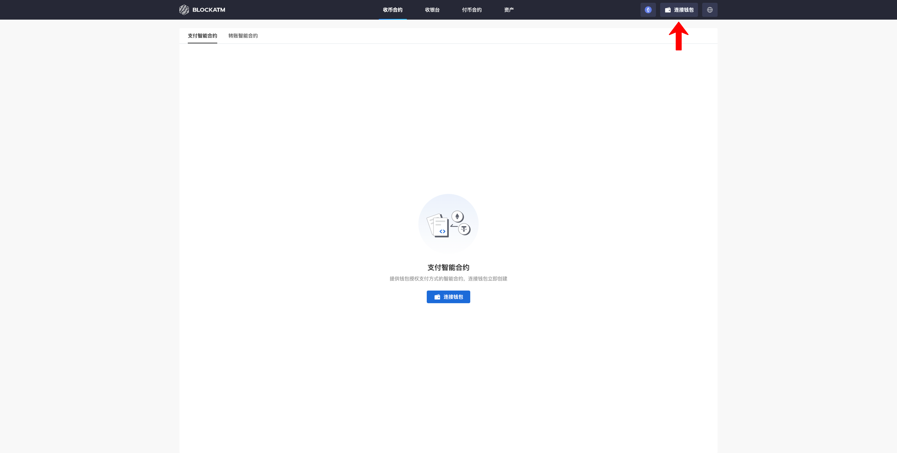
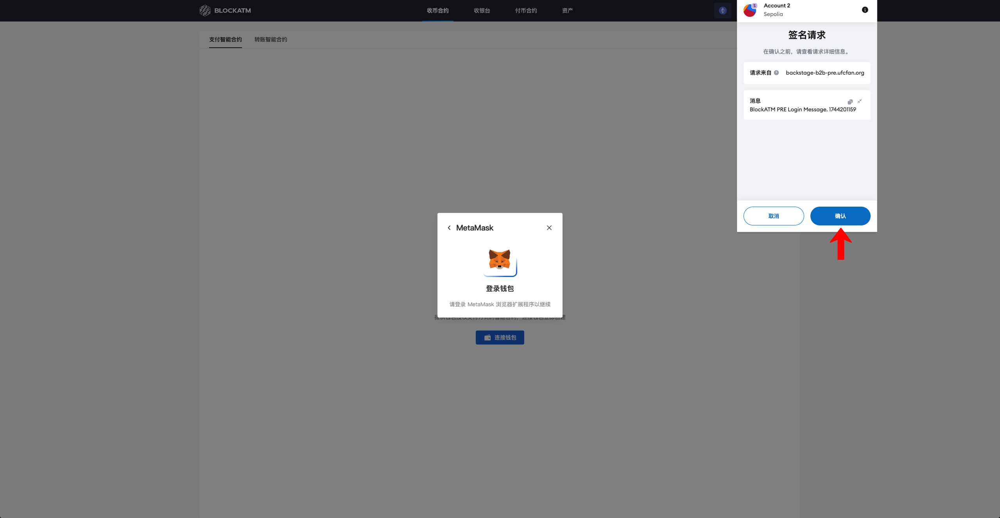
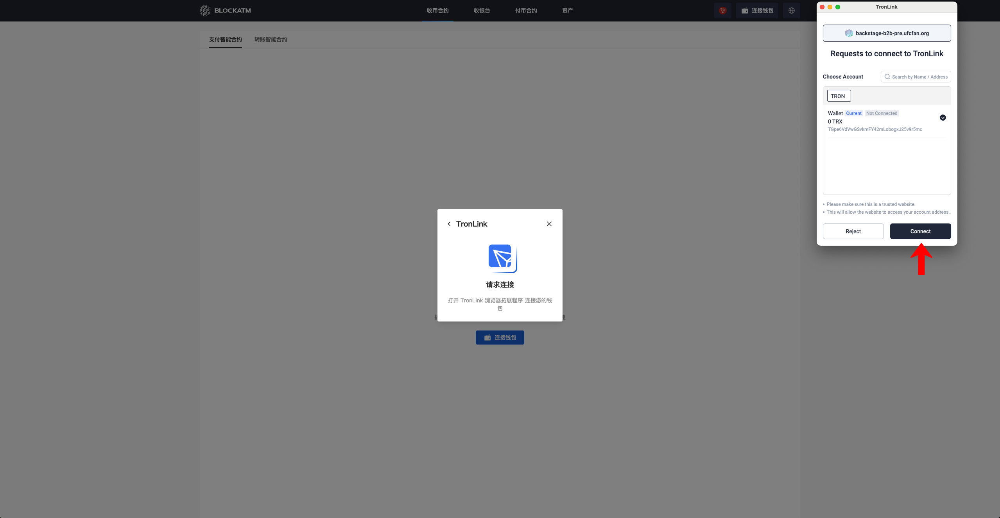
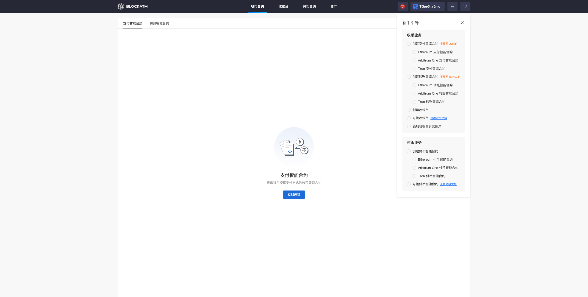

---
layout:
  title:
    visible: true
  description:
    visible: false
  tableOfContents:
    visible: true
  outline:
    visible: true
  pagination:
    visible: true
---

# 连接钱包

BlockATM 是运营在区块链上的 DApp，通过连接钱包的方式进行登录，在 BlockATM 页面点击右上角“连接钱包”按钮开始连接您的钱包

<figure><figcaption></figcaption></figure>

选择网络以及连接钱包的方式

若选择 Ethereum 或者 Arbitrum 网络，则连接钱包的方式有 MetaMask 和 WalletConnect，此处演示使用 MetaMask 浏览器拓展程序连接

<figure><figcaption></figcaption></figure>

点击 "MetaMask" 会唤起 MetaMask 钱包浏览器拓展程序进行确认连接，点击 "连接"

<figure><figcaption></figcaption></figure>

接着钱包弹出签名请求窗口，点击"确认"，进行登录确认

<figure><figcaption></figcaption></figure>

确认后即可成功连接钱包

<figure><figcaption></figcaption></figure>

若选择 Tron 网络，则连接钱包的方式仅有 TronLink，详细连接方式见：[如何连接 Tronlink 钱包](../../networkAndWallet/wallets/tronlink/ru-he-lian-jie-tronlink-qian-bao.md)

<figure><figcaption></figcaption></figure>

点击 "TronLink" 会唤起 TronLink 钱包浏览器拓展程序进行确认连接，点击 "连接"

<figure><figcaption></figcaption></figure>

接着钱包弹出签名请求窗口，点击"确认"，进行登录确认

<figure><figcaption></figcaption></figure>

确认后即可成功连接钱包

<figure><figcaption></figcaption></figure>
