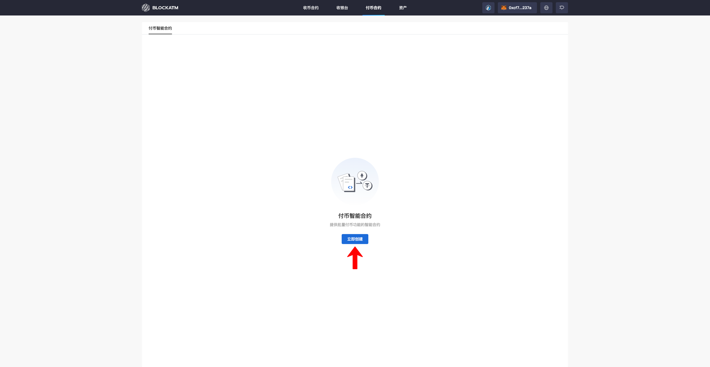
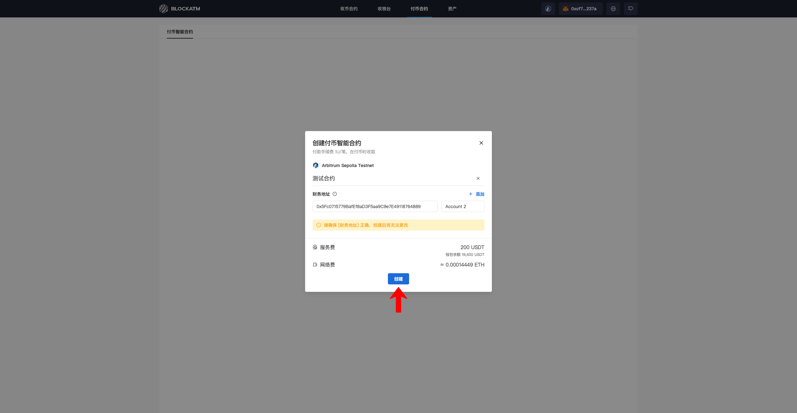
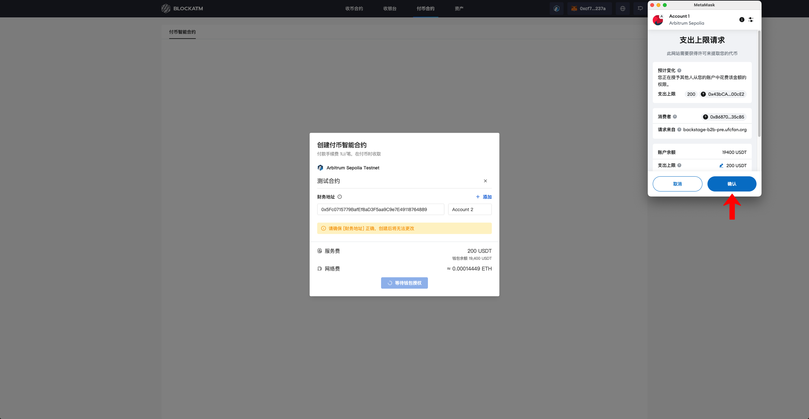
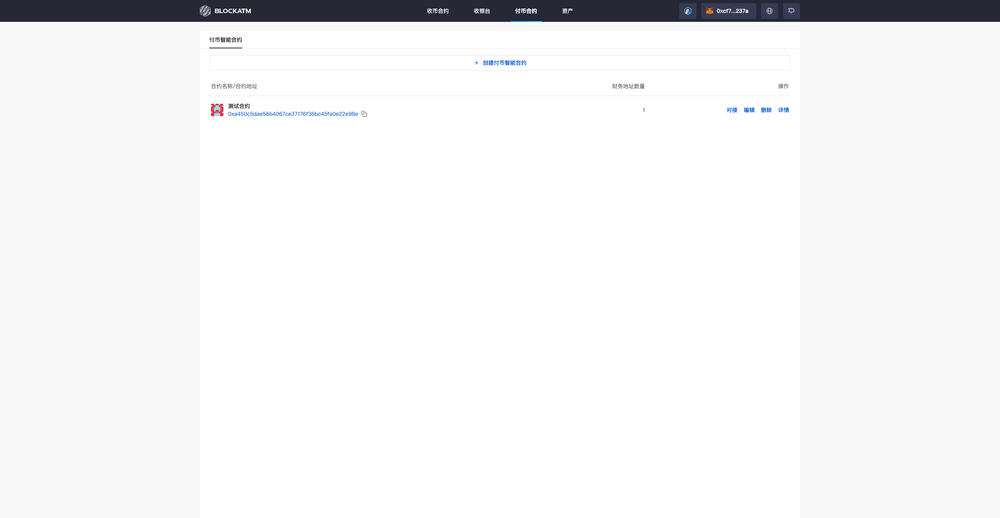

---
layout:
  title:
    visible: true
  description:
    visible: false
  tableOfContents:
    visible: true
  outline:
    visible: true
  pagination:
    visible: true
---

# 创建付币合约

在付币合约页面，点击“立即创建”按钮

<figure><figcaption></figcaption></figure>

在创建付币智能合约弹窗输入合约信息

<figure><figcaption></figcaption></figure>

输入完成后点击“创建”（注意：提前准备好 200 USDT 和 足够的 Gas Fee，若 USDT 或 Gas Fee 不足则无法创建）

<figure><figcaption></figcaption></figure>

点击“创建”后会唤起钱包进行 USDT 支出授权（创建合约的服务费）

<figure><figcaption></figcaption></figure>

接着签名确认同意部署智能合约，并等待区块链确认交易完成

<figure><figcaption></figcaption></figure>

区块确认完成交易完成则付币智能合约创建成功，弹窗关闭，在列表页面能看到刚创建的合约

<figure><figcaption></figcaption></figure>

