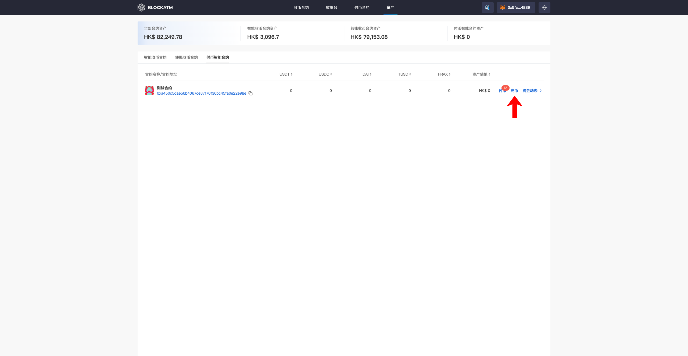
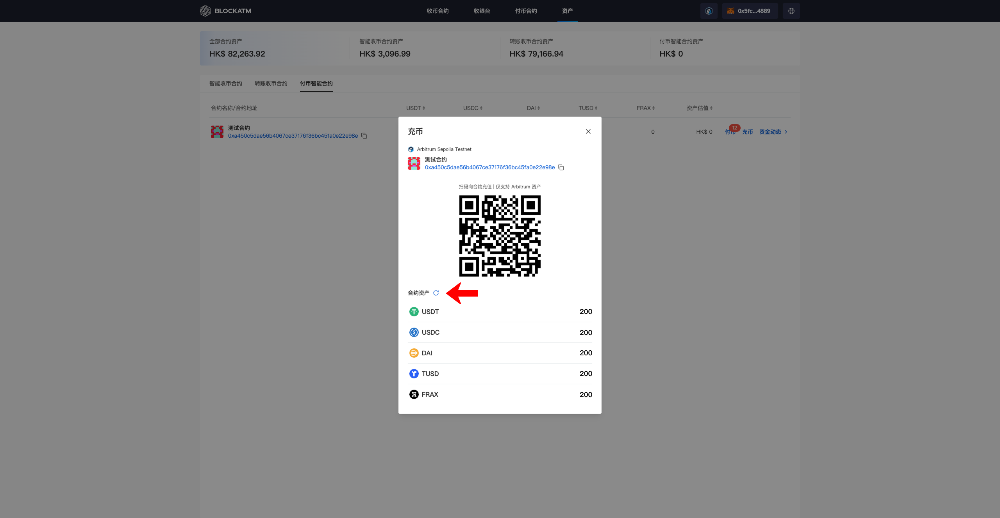

---
layout:
  title:
    visible: true
  description:
    visible: false
  tableOfContents:
    visible: true
  outline:
    visible: true
  pagination:
    visible: true
---

# 充币

批量付币是通过付币合约将合约中的资产批量付给指定的钱包地址，在[创建付币合约](chuang-jian-fu-bi-zhi-neng-he-yue.md)后，需要先往合约充币，有了足够的资产后才能顺利付币

首先连接"授权签名地址"钱包，"授权签名地址"在资产模块--付币合约--能见到 "充币" 按钮，点击 "充币"

<figure><figcaption></figcaption></figure>

充币弹窗中展示付币智能合约信息以及各代币的资产数量，可通过手机钱包扫描合约地址二维码或者复制合约地址到钱包中转账，为付币合约充币

<figure><figcaption></figcaption></figure>

交易完成后可以点击 "刷新" 按钮，刷新资产数据

<figure><figcaption></figcaption></figure>
