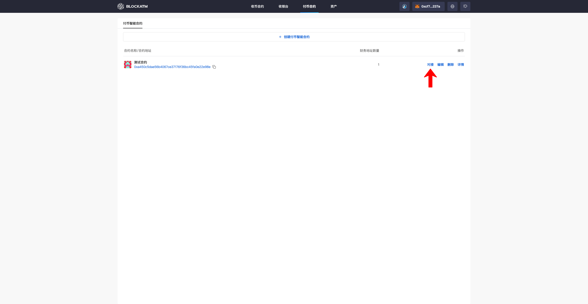
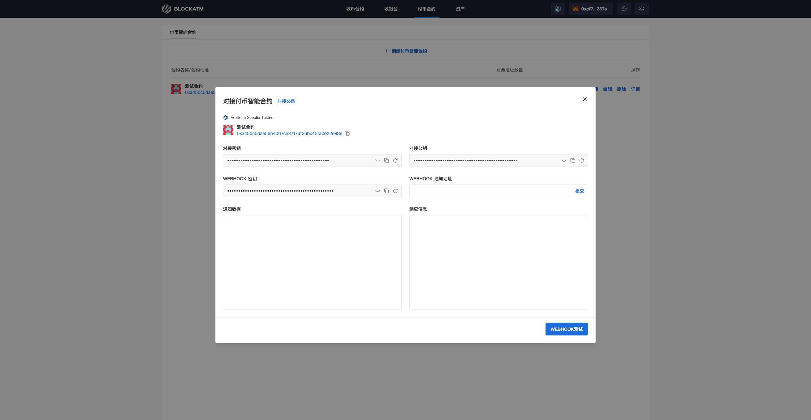
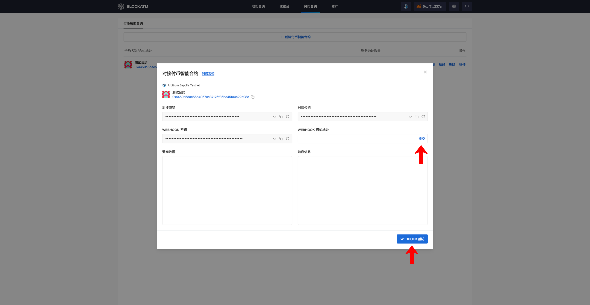

---
layout:
  title:
    visible: true
  description:
    visible: false
  tableOfContents:
    visible: true
  outline:
    visible: true
  pagination:
    visible: true
---

# 对接付币智能合约

[创建付币智能合约](chuang-jian-fu-bi-zhi-neng-he-yue.md)后，点击 "对接" 以实现API上传付币订单以及接收付币结果通知

<figure><figcaption></figcaption></figure>

在对接付币智能合约的弹窗中，可看到 合约信息、对接密钥公钥、 Webhook 密钥、 Webhook 通知地址

<figure><figcaption></figcaption></figure>


对接步骤说明

1. 将对接密钥配置到你的系统中，用于对请求数据进行加密或签名。
2. 将对接公钥配置到你的系统中，用于对接收到的数据进行验签。
3. 输入 Webhook 通知地址，用于接收 BlockATM 发送的通知消息。需要确保这个地址能够正常接收和处理HTTP POST请求。
4. 将Webhook密钥配置到你的系统中，并在接收到通知时进行签名验证。
5. 使用对接密钥对请求数据进行加密或签名，然后通过HTTP请求发送到 BlcokATM 接口地址。
6. 在您服务器上部署一个能够接收Webhook通知的接口，当 BlcokATM 发送通知时，您的接口会收到一个HTTP POST请求。您需要对接收到的数据进行签名验证。
7. 发送测试请求到 BlcokATM 的接口地址，检查返回的结果是否符合预期。
8. 触发 BlcokATM 发送 Webhook 通知，检查你的服务器是否能够正常接收和处理通知。


完成对接之后，点击 "Webhook 测试"，进行 Webhook 测试和验证

<figure><figcaption></figcaption></figure>
