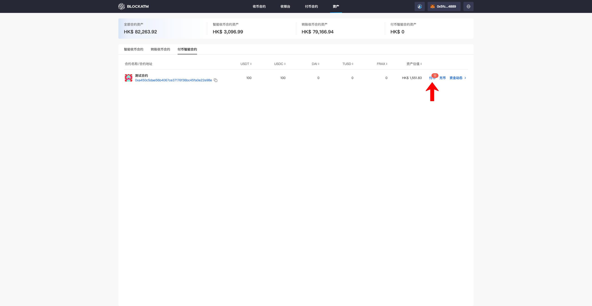
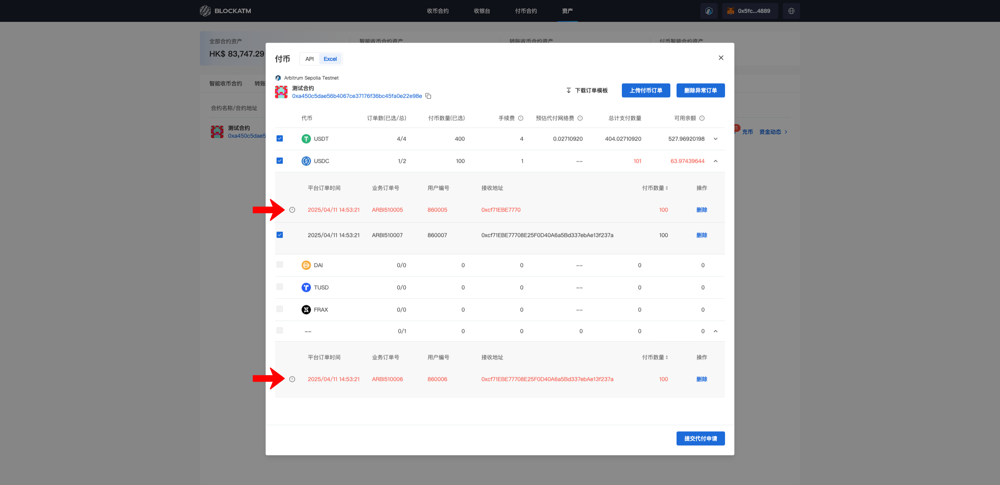

---
layout:
  title:
    visible: true
  description:
    visible: false
  tableOfContents:
    visible: true
  outline:
    visible: true
  pagination:
    visible: true
---

# 上传并确认付币订单

[创建付币合约](chuang-jian-fu-bi-zhi-neng-he-yue.md)且给合约[充币](chong-bi.md)有足够的资产后，可以进行付币操作；BlockATM 提供了 API上传 和 导入Excel上传 两种上传付币订单的方式；需要注意的是付币只能由合约指定的"授权签名地址"执行（"授权签名地址"权限说明见：[付币合约](../../../pi-liang-fu-bi/fu-bi-zhi-neng-he-yue.md#he-yue-quan-xian-shuo-ming)）

### API上传付币订单

#### 前置条件：需先[对接付币合约](dui-jie-fu-bi-zhi-neng-he-yue.md)

首先连接"授权签名地址"钱包，"授权签名地址"在资产模块--付币合约--能见到 "付币" 按钮（当有要订单时 "付币" 按钮上会显示订单数量）

<figure><figcaption></figcaption></figure>

点击 "付币" 后弹出付币弹窗，默认展示API上传的订单，点击列表展开各代币的付币订单详情

<figure><figcaption></figcaption></figure>

展开后逐一核对订单信息，若发现异常订单，可以选择 "拒付" 或者先 "取消勾选"

<figure><figcaption></figcaption></figure>

若选择拒付会唤起钱包签名确认（确保是"授权签名地址"在操作）

<figure><figcaption></figcaption></figure>

核对完订单后点击 "提交代付申请"，唤起钱包签名确认（确保是"授权签名地址"在操作）

<figure><figcaption></figcaption></figure>

提交完成后，可点击 "付币记录" 查看付币订单状态（也可在资产--付币合约--资金动态--付币记录查看）

<figure><figcaption></figcaption></figure>

刚提交的付币订单状态为 "待支付"，将在24小时内完成支付

<figure><figcaption></figcaption></figure>

若想实现自动化，无需"授权签名地址"人工审核，可以开启自动提交功能，当订单上传后一定时间内"授权签名地址"没有审核，则自动审核并提交

<figure><figcaption></figcaption></figure>

### 导入 Excel 上传付币订单

首先连接"授权签名地址"钱包，"授权签名地址"在资产模块--付币合约--能见到 "付币" 按钮（当有要订单时 "付币" 按钮上会显示订单数量），在付币弹窗中切换到 "Excel"

<figure><figcaption></figcaption></figure>

点击 "下载订单模板"，在模板中填入付币订单信息

<figure><figcaption></figcaption></figure>

注意：网络、代币、付币数量等信息需要按规则输入

<figure><figcaption></figcaption></figure>

接着点击 "上传付币订单" 将 Excel文件上传到 BlockATM

<figure><figcaption></figcaption></figure>

上传成功会展示各代币的订单信息，若付币数量大于代币资产数量，会标红提示，需取消勾选或者删除部分订单

<figure><figcaption></figcaption></figure>

若上传了错误信息/格式的订单会标红并提示错误原因（可删除错误订单并根据原因调整后再重新上传）

<figure><figcaption></figcaption></figure>

订单都确认后，点击 "提交代付申请"&#x20;

<figure><figcaption></figcaption></figure>

唤起钱包签名确认（确保是"授权签名地址"在操作）

<figure><figcaption></figcaption></figure>

签名确认后，可点击 "付币记录" 查看付币订单状态（也可在资产--付币合约--资金动态--付币记录查看）

<figure><figcaption></figcaption></figure>

刚提交的付币订单状态为 "待支付"，将在24小时内完成支付

<figure><figcaption></figcaption></figure>
