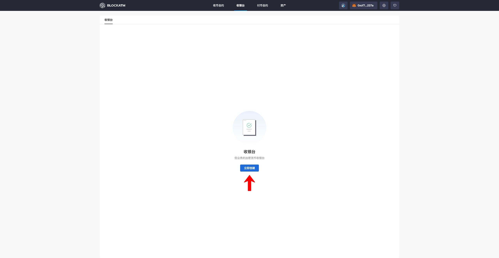
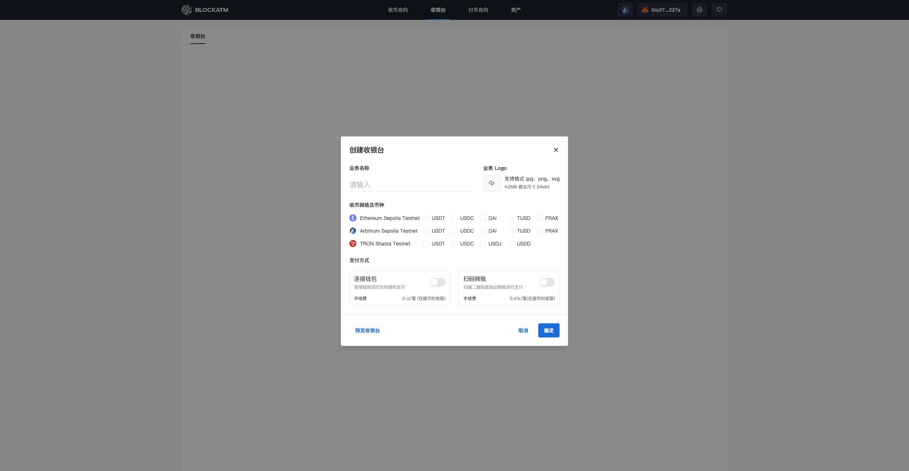
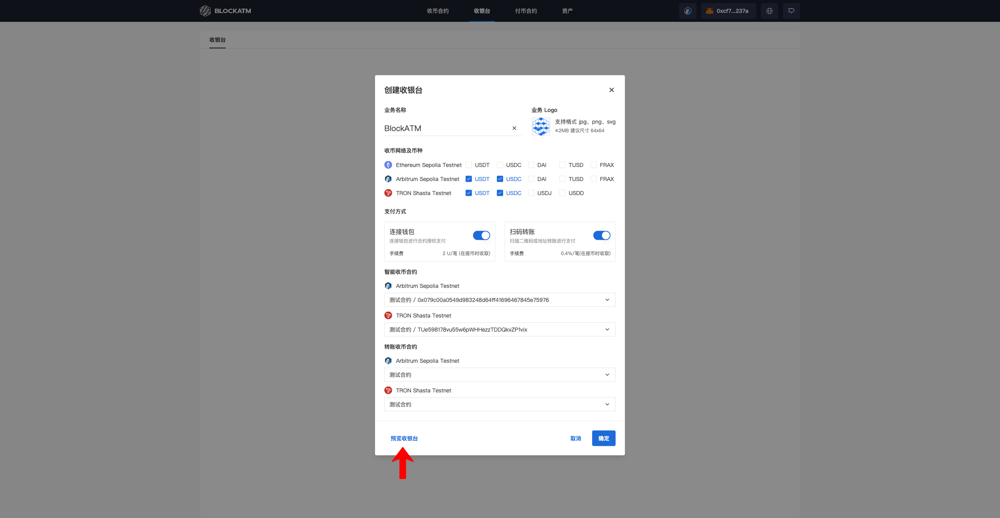
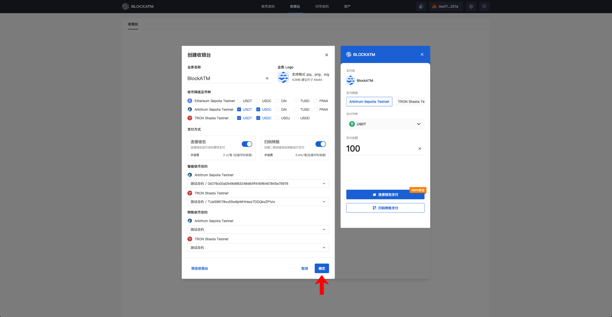
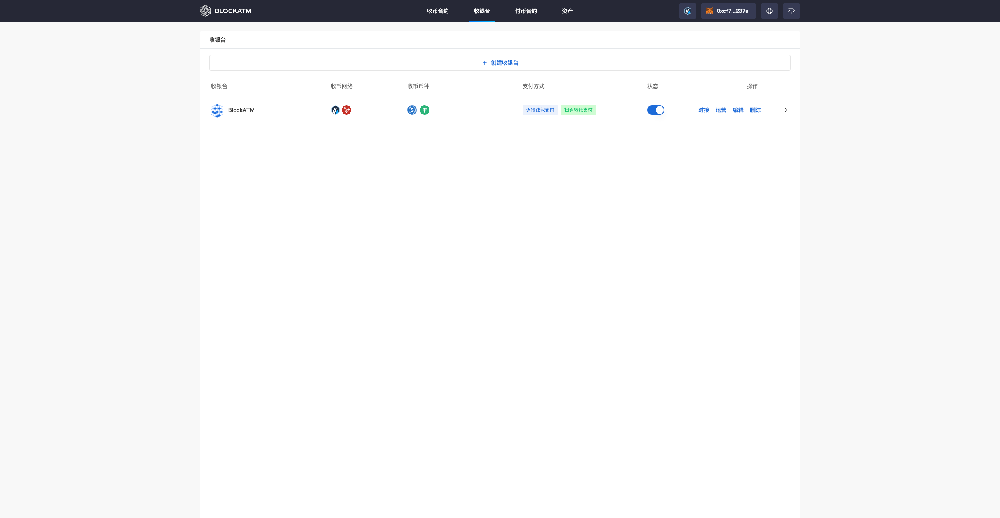

---
layout:
  title:
    visible: true
  description:
    visible: false
  tableOfContents:
    visible: true
  outline:
    visible: true
  pagination:
    visible: true
---

# 创建收银台

[创建收币合约](chuang-jian-shou-bi-zhi-neng-he-yue.md)后，即可创建收银台，前往收银台页面，点击 "立即创建"

<figure><figcaption></figcaption></figure>

在创建收银台弹窗输入您的业务信息、选择收币网络及币种、启用支付方式 以及 <mark style="color:orange;">绑定的收币合约</mark>（一个收币智能合约只能绑定一个收银台）

<figure><figcaption></figcaption></figure>

配置完成后可以点击左下角 "预览收银台" 进行预览

<figure><figcaption></figcaption></figure>

预览确认后，点击 "确认" 完成收银台的创建

<figure><figcaption></figcaption></figure>

<figure><figcaption></figcaption></figure>
