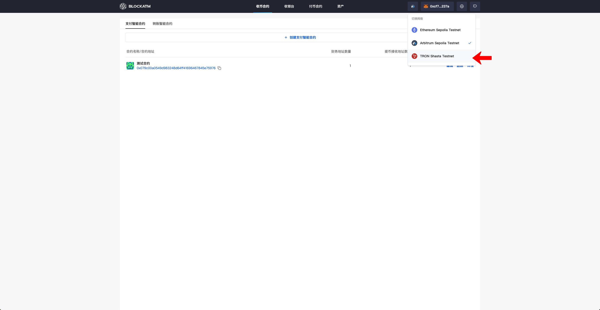
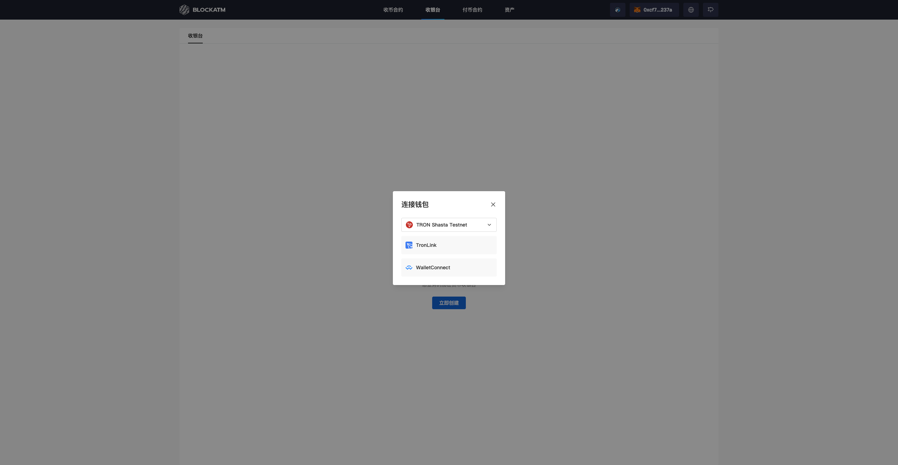
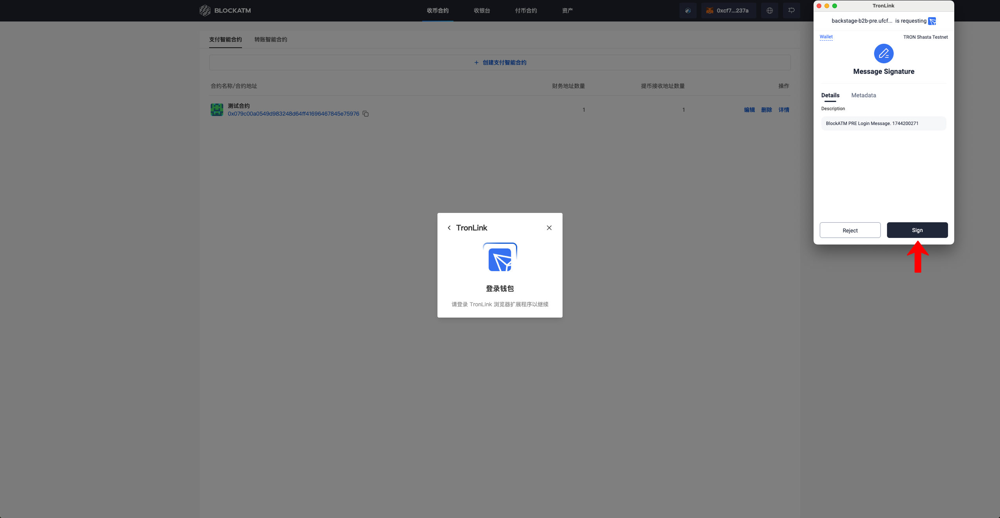
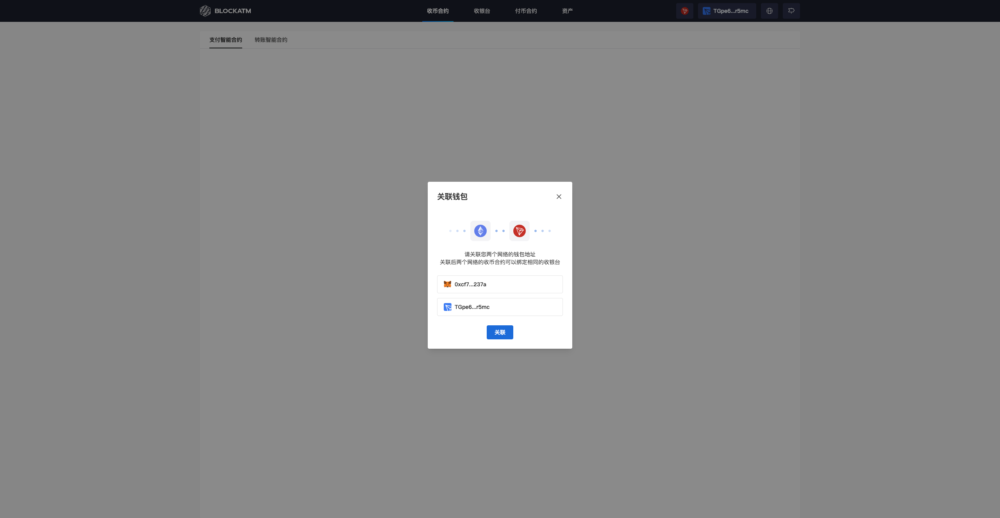

---
layout:
  title:
    visible: true
  description:
    visible: false
  tableOfContents:
    visible: true
  outline:
    visible: true
  pagination:
    visible: true
---

# 关联 ERC20 和 TRC20 钱包

创建智能合约（[收币智能合约](chuang-jian-shou-bi-zhi-neng-he-yue.md)或[付币智能合约](../kai-shi-fu-bi/chuang-jian-fu-bi-zhi-neng-he-yue.md)）后，合约 Owner 的钱包地址将作为管理员钱包，管理员钱包在创建收银台时可以选择关联目标网络的收币智能合约，若想同时关联 ERC 网络和 TRC 网络，需将ERC20 和 TRC20 钱包进行关联。

### 关联钱包


假设您先在 ERC 网络创建了收币智能合约，然后再切换到 TRC 网络。


点击右上角的 "网络" — 切换到 "Tron"

<figure><figcaption></figcaption></figure>

弹出 Tron 网络连接钱包方式（TronLink、WalletConnect），此处演示使用 TronLink 浏览器拓展程序连接

<figure><figcaption></figcaption></figure>

点击“TronLink”后会唤起 TronLink 钱包浏览器拓展程序进行确认连接

<figure><figcaption></figcaption></figure>

连接成功后弹出关联弹窗，点击“关联”即可完成 ERC 网络和 TRC 网络的钱包关联

<figure><figcaption></figcaption></figure>

钱包关联后再去创建收银台时可以在收银台同时绑定两个钱包创建的收币智能合约
