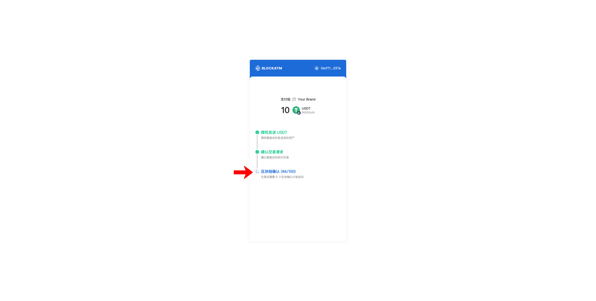
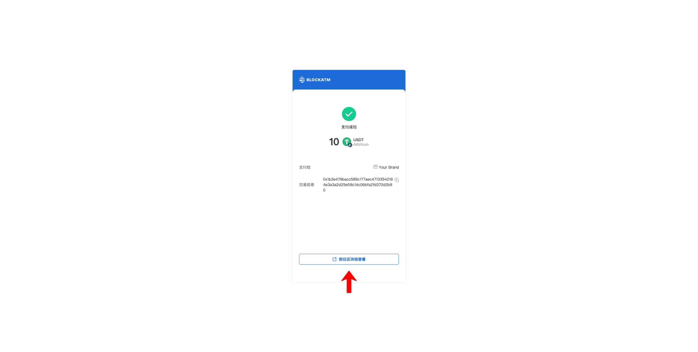

---
layout:
  title:
    visible: true
  description:
    visible: false
  tableOfContents:
    visible: true
  outline:
    visible: true
  pagination:
    visible: true
---

# 收币

对接收银台后，您的用户即可在您的业务平台唤起 BlockATM 收银台进行支付

### 支付流程

您的用户在您的业务平台唤起 BlockATM 收银台

<figure><figcaption></figcaption></figure>

打开收银台后，选择支付网络、支付币种、输入支付金额

<figure><figcaption></figcaption></figure>

<figure><figcaption></figcaption></figure>

### 接着选择支付方式，若选择连接钱包支付

会唤起连接钱包方式（以 MetaMask（浏览器拓展程序）为例）

<figure><figcaption></figcaption></figure>

选择 MetaMask 后唤起钱包进行连接，点击“连接”，同意钱包与 BlockATM收银台 连接

<figure><figcaption></figcaption></figure>

连接钱包后，收银台进入支付确认页面，点击“立即支付”开始支付流程

<figure><figcaption></figcaption></figure>

首先唤起钱包支出上限请求，点击“确认”以同意智能合约调用钱包指定数量的资产

<figure><figcaption></figcaption></figure>

接着弹出交易请求，点击“确认”进行链上交易

<figure><figcaption></figcaption></figure>

确认交易后，等待区块链确认

<figure><figcaption></figcaption></figure>

区块链确认完成后，交易完成，可前往区块链浏览器查看交易详情

<figure><figcaption></figcaption></figure>

### 若选择扫码转账支付

收银台进入支付确认页面，展示收款地址二维码

<figure><figcaption></figcaption></figure>

打开钱包App扫描收款地址二维码，或者复制收款地址到钱包应用中进行转账

钱包授权

确认交易

等待区块链确认（注意：若钱包执行交易后收银台页面未自动跳转到结果页，可点击“我已支付”按钮）

区块链确认完成后，交易完成，可前往区块链浏览器查看交易详情

<figure><figcaption></figcaption></figure>

