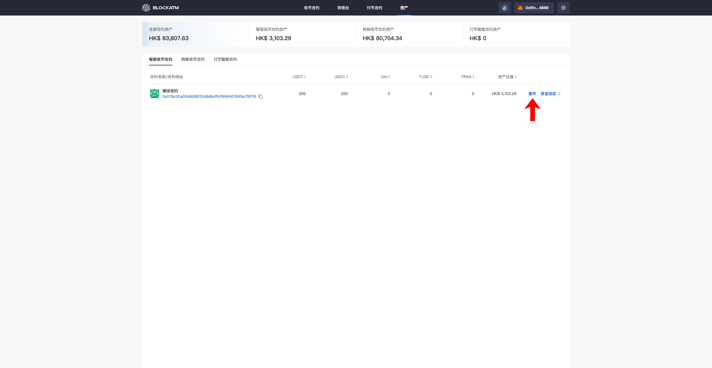
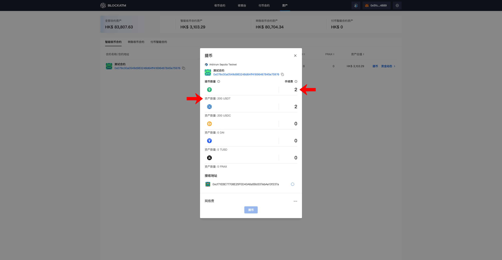
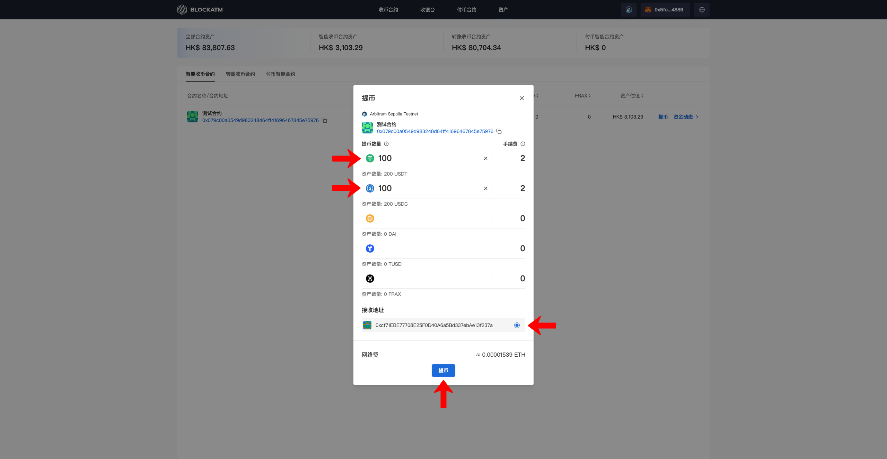
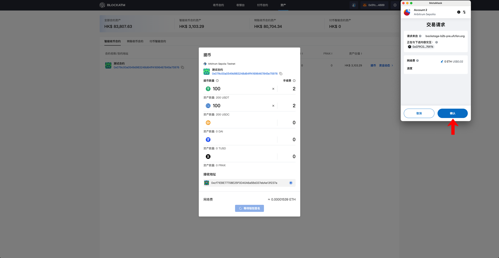
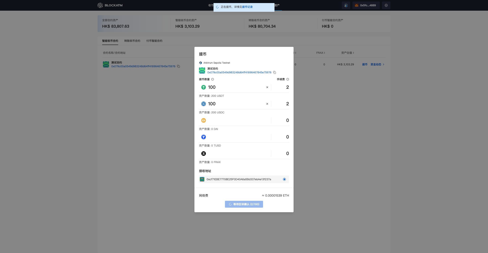
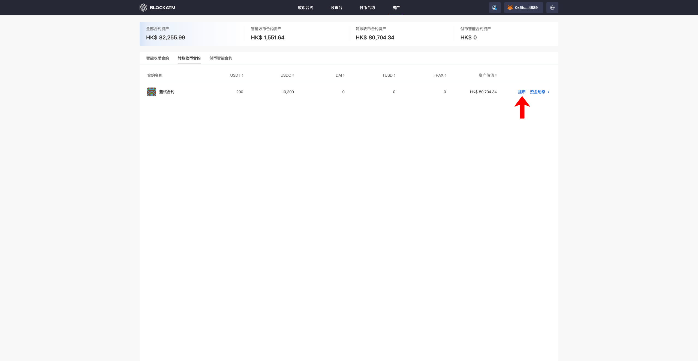
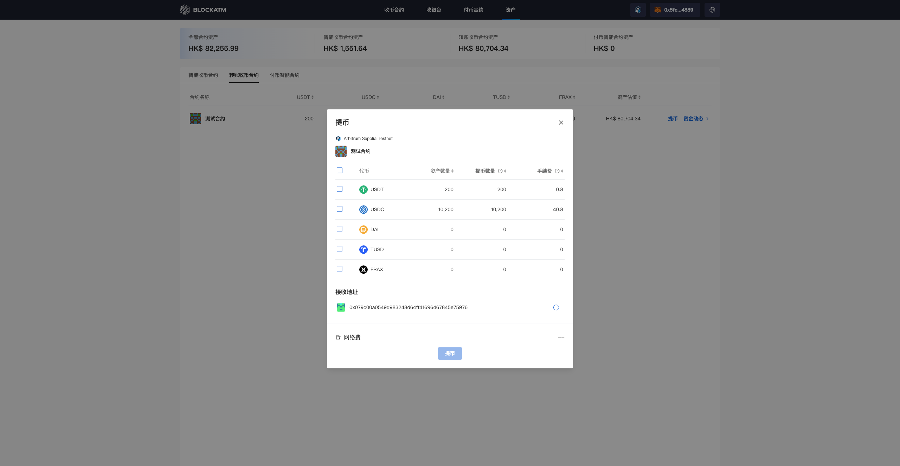
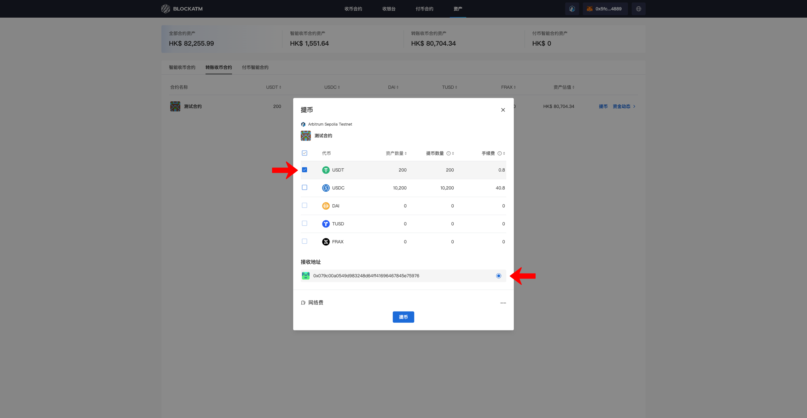
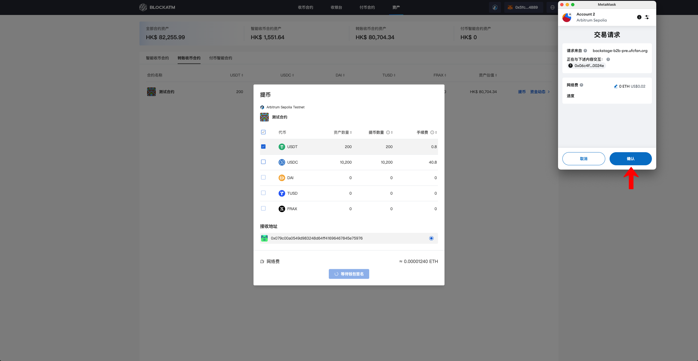
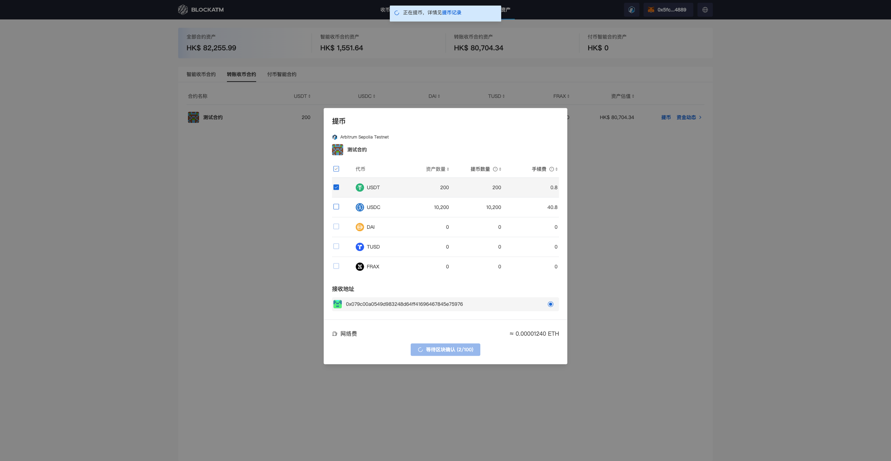

---
layout:
  title:
    visible: true
  description:
    visible: false
  tableOfContents:
    visible: true
  outline:
    visible: true
  pagination:
    visible: true
---

# 提币

收银台收到的加密货币托管在关联的收币合约，若要将资产从收币合约中提出，需要合约指定的"授权签名地址"发起提币，提取到合约指定的"资产接收地址"（"授权签名地址"和"资产接收地址"权限说明见：[收币合约](../../../ye-wu-shuo-ming/an-quan-shou-bi/shou-bi-zhi-neng-he-yue.md#he-yue-quan-xian-shuo-ming)）

### Web3收币合约提币

首先连接"授权签名地址"钱包，"授权签名地址"在资产模块--Web3收币合约--能见到 "提币" 按钮，点击 "提币"

<figure><figcaption></figcaption></figure>

提币弹窗中展示Web3收币合约各代币的资产数量以及提币的手续费

<figure><figcaption></figcaption></figure>

要提取的代币输入提币数量，并选择"资产接收地址"，此时 "提币" 按钮高亮，接着点击 "提币"

<figure><figcaption></figcaption></figure>

点击 "提币" 会唤起钱包签名授权交易

<figure><figcaption></figcaption></figure>

授权后交易执行，等待区块链确认

<figure><figcaption></figcaption></figure>

区块确认完成则提币成功

***

### 扫码收币合约提币

首先连接"授权签名地址"钱包，"授权签名地址"在资产模块--扫码收币合约--能见到 "提币" 按钮，点击 "提币"

<figure><figcaption></figcaption></figure>

提币弹窗中展示扫码收币合约各代币的资产数量以及提币的手续费

<figure><figcaption></figcaption></figure>

勾选要提取的代币（默认提取全部数量），并选择提币"资产接收地址"，此时 "提币" 按钮高亮，接着点击 "提币"

<figure><figcaption></figcaption></figure>

点击 "提币" 会唤起钱包签名授权交易

<figure><figcaption></figcaption></figure>

授权后交易执行，等待区块链确认

<figure><figcaption></figcaption></figure>

区块确认完成则提币成功

<figure><figcaption></figcaption></figure>
