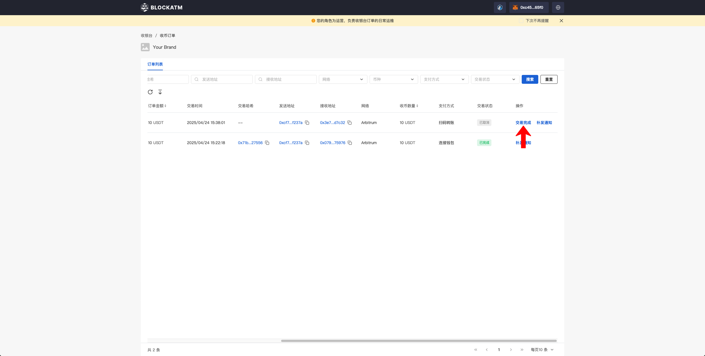
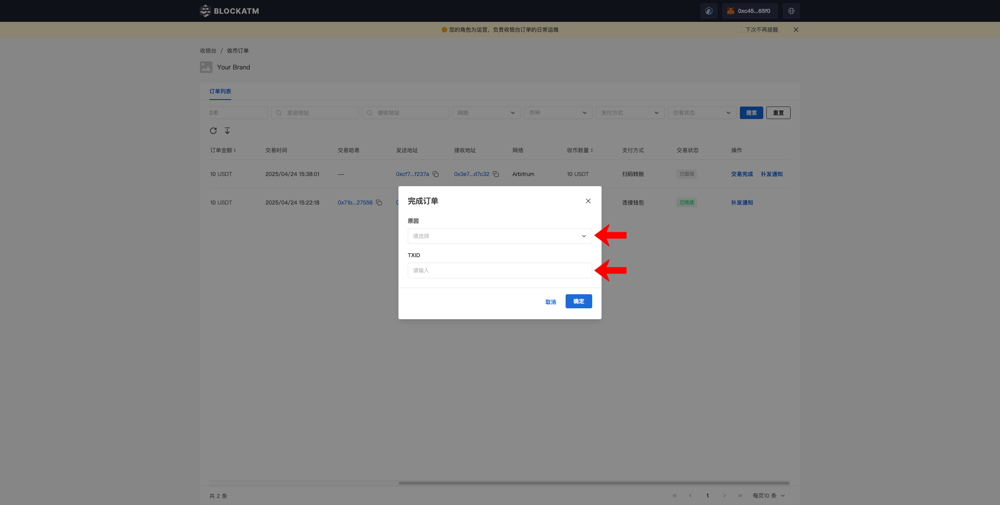
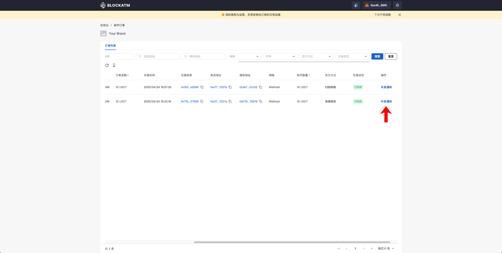

---
layout:
  title:
    visible: true
  description:
    visible: false
  tableOfContents:
    visible: true
  outline:
    visible: true
  pagination:
    visible: true
---

# 异常订单处理

一般情况下收币订单状态都能正常流转，但也有小概率发生异常情况：

* **掉单：**&#x7528;户已完成支付，但订单状态未流转为成功
* **通知异常：**&#x8BA2;单的 Webhook 通知已发送但商户未收到

为此需要对上述两类异常订单进行处理，而只有收银台的运营地址有权限对异常订单进行操作，运营地址需要管理员在收银台添加

### 添加收银台运营用户

管理员地址在收银台列表，点击“运营”按钮，打开运营用户弹窗

<figure><figcaption></figcaption></figure>

在运营用户弹窗中点击“添加运营”

<figure><figcaption></figcaption></figure>

接着在添加运营弹窗中输入运营的钱包地址、昵称，输入完后点击“添加”，即可添加成功

<figure><figcaption></figcaption></figure>

<figure><figcaption></figcaption></figure>

### 运营钱包登录

运营钱包连接登录 BlockATM DApp 可以只能看到相关收银台，点击收银台的“收币订单”进入订单页面

<figure><figcaption></figcaption></figure>

<figure><figcaption></figcaption></figure>

### 掉单--完成交易

若存在未正常完成的订单，在操作列会展示“交易完成”按钮，点击“交易完成”弹出手动完成订单弹窗

<figure><figcaption></figcaption></figure>

在弹窗中选择补单原因以及输入TXID，点击“确定”即可完成补单

<figure><figcaption></figcaption></figure>

补单成功的订单的状态会流转为“已完成”

<figure><figcaption></figcaption></figure>

### 通知异常--补发通知

若您的业务系统未收到交易状态为已完成、失败的订单 Webhook通知，在72小时内可以运营用户可以点击操作列中的“补发通知”按钮，再次发送Webhook通知

<figure><figcaption></figcaption></figure>
