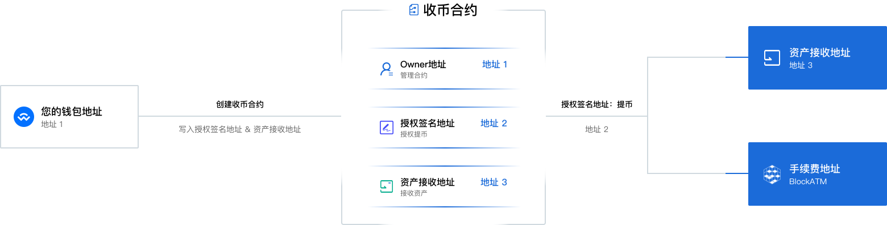

---
layout:
  title:
    visible: true
  description:
    visible: false
  tableOfContents:
    visible: true
  outline:
    visible: true
  pagination:
    visible: true
---

# 核心优势

### 自托管智能合约，资产100%安全

企业在 BlockATM 创建的智能合约归属于企业，在区块链上公开透明、不可篡改，企业完全掌控合约的管理权。

企业的资产自托管智能合约，有且只有企业指定的"授权签名地址"可以从智能合约中提取资产到指定的"资产接收地址"，除此之外任何中心化机构都无权限提取，包括 BlockATM。

<figure><figcaption></figcaption></figure>

### 安全支付

用户通过连接钱包授权智能合约执行交易，安全可靠，可避免发生金额或收款地址错误的错误支付/转账。

### 无需 KYB、KYC

BlockATM 是运行在区块链上的DApp，企业无需向政府或中心化机构提交KYB、KYC资料，即可展业。

### 没有限制

资产提取无额度限制、无时间限制。

### 无需许可

资产提取无需中心化机构许可

### 收费透明且固定

| 类型         | 费用        |
| ---------- | --------- |
| 智能合约服务费    | 200 USD/张 |
| 收币手续费      |           |
|     连接钱包支付 | 2 USD/笔   |
|     扫码转账支付 | 0.4% /笔   |
| 付币手续费      | 1 USD/笔   |


更详细的收费规则见：[安全收币--服务费用](../ye-wu-shuo-ming/an-quan-shou-bi/fu-wu-fei-yong.md)、[批量付币--服务费用](../pi-liang-fu-bi/fu-wu-fei-yong.md)


### 集成简单且快速

通过小部件代码，一键复制并嵌入到您的业务代码中完成集成。


[ji-cheng-shou-yin-tai](../ji-cheng-shou-yin-tai/)


Oz
