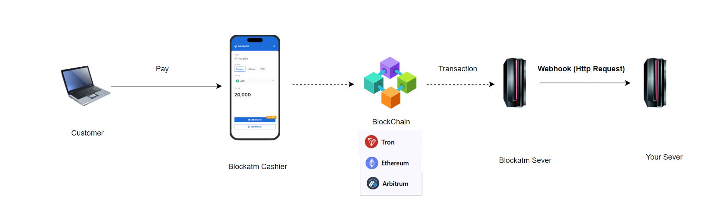

# 获取测试币

### Ethereum Sepolia  TestNet

&#x20;Blockatm使用sepolia作为以太坊测试网络，如果缺少eth作为交易费用，建议通过下面地址来获取测试eth:

[https://sepolia-faucet.pk910.de/](https://sepolia-faucet.pk910.de/)

### Tron Shasta TestNet

&#x20;Blockatm使用shasta 作为以太坊测试网络，如果缺少trx作为交易费用，可以加入[Tron Telegram 官方社群](https://t.me/TronOfficialTechSupport2)，通过发送 "!shasta \[address]" 来自动领取.

<figure><figcaption></figcaption></figure>

### Arbitrum Sepolia TestNet

arbitrum 作为以太坊二层网络，可以通过官方[跨链桥](https://bridge.arbitrum.io/?destinationChain=arbitrum-sepolia\&sourceChain=sepolia)把资产从Ethereum Sepolia转移到Arbitrum Sepolia

<figure><figcaption></figcaption></figure>

### 测试资产（ERC20 or TRC20 ）

你可以根据所在的网络，向下面的地址转入一点点的原生币（比如0.0001 eth），来获取Blockatm所需要的所有测试币资产。

| Network                  | Faucet Address                             |
| ------------------------ | ------------------------------------------ |
| Ethereum Sepolia Testnet | 0xd611c098e26b2B6095F22F4bFfEB1Af1DA597b39 |
| Arbitrum Sepolia Testnet | 0xad05853cc8395fdbbd0b1c72d2eb9491007e8dd0 |
| Optimism Sepolia Testnet | 0x0d5d82cff0e742ca3dffc0a2311b64f39d6feaa7 |
| Tron Shasta Testnet      | 补充中...                                     |

### 添加测试币地址&#x20;

&#x20;一旦你获取了测试币，你可以在你的钱包中添加你的资产，测试资产合约地址如下：

| 币种   | 网络                       | 合约地址                                       |
| ---- | ------------------------ | ------------------------------------------ |
| DAI  | Arbitrum Sepolia Testnet | 0x6B2576Ab5AAe6E479fb73611BcB2e4E71126FeAf |
|      | Optimism Sepolia Testnet | 0xc70FbcebCAA4c877c18D80aF62f42534bD18eB6D |
|      | Ethereum Sepolia Testnet | 0xf54cc6b8335a967fa932a2cef7859cf911cfc582 |
| USDT | Tron Shasta Testnet      | TEYKWmKvdCHX2NuX4tVmhxdN4P3PVjyMcu         |
|      | Arbitrum Sepolia Testnet | 0x43bCA8Fe12a7888224a7e76ec938eD9a29800cE2 |
|      | Optimism Sepolia Testnet | 0x43bCA8Fe12a7888224a7e76ec938eD9a29800cE2 |
|      | Ethereum Sepolia Testnet | 0x0C556DFC43A1de7fDaAdC798e7AA0fd90E62f54E |
| USDC | Tron Shasta Testnet      | TWjJj93GX51rJ8GRFihPVNA15ieLoheKaj         |
|      | Arbitrum Sepolia Testnet | 0x116789307A429dE86F50d9d04a130b6E99a2107B |
|      | Optimism Sepolia Testnet | 0x3b1Cf5438607051231beCAA0243c47C5BD60aeec |
|      | Ethereum Sepolia Testnet | 0x16033f59599c63fdc1de1c8fe569dcbd1f0d9da3 |
| TUSD | Arbitrum Sepolia Testnet | 0x58Bd5D31c29Cd0cfa89496640C3009578B98E6b5 |
|      | Optimism Sepolia Testnet | 0x9edccc68f41aa94cf78b08b90ea7e8bc899c874f |
|      | Ethereum Sepolia Testnet | 0x834728a523ddb8f367459eafa7bec8b85767714c |
| FRAX | Arbitrum Sepolia Testnet | 0x9eDcCc68F41aa94cF78B08b90Ea7e8Bc899c874F |
|      | Optimism Sepolia Testnet | 0x76Cf3f571BCB7333E1EC5588FFd6224837D4ed33 |
|      | Ethereum Sepolia Testnet | 0x79aFa1A88a0EF3F0Afc39153C8f178F82db51326 |
| USDJ | Tron Shasta Testnet      | TDTNSJAYgQaEVT271PKybvDzJTmYzR9DUm         |
| USDD | Tron Shasta Testnet      | TUrhpa8bD4u6E11ZtKGRxY8uoBVAUNcmco         |

操作截图（MetaMask,其他钱包类似）：

.png>).png>)\

