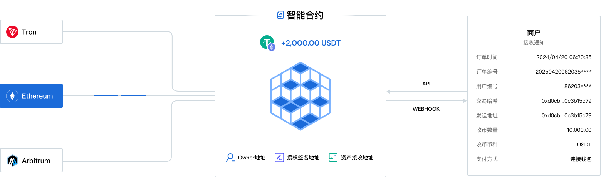

---
layout:
  title:
    visible: true
  description:
    visible: false
  tableOfContents:
    visible: true
  outline:
    visible: true
  pagination:
    visible: true
---

# 运作流程

用户在您的业务平台唤起 BlockATM 的收银台，确认订单信息并选择支付方式（连接钱包支付、扫码转账支付）进行支付，用户支付后等待区块链确认，过程中 BlockATM 将持续监听区块链交易信息，监听到您的收币智能合约成功收到资金后会通过Webhook 发送通知到您的业务系统。

<figure><figcaption></figcaption></figure>


收银台支付方式可以按需配置，如需连接钱包支付则收银台需关联合e约，如需扫码转账支付则收银台需关s账智能合约，两种智能合约均为收币智能合约，详情介绍见：[收币智能合约](shou-bi-zhi-neng-he-yue.md)


